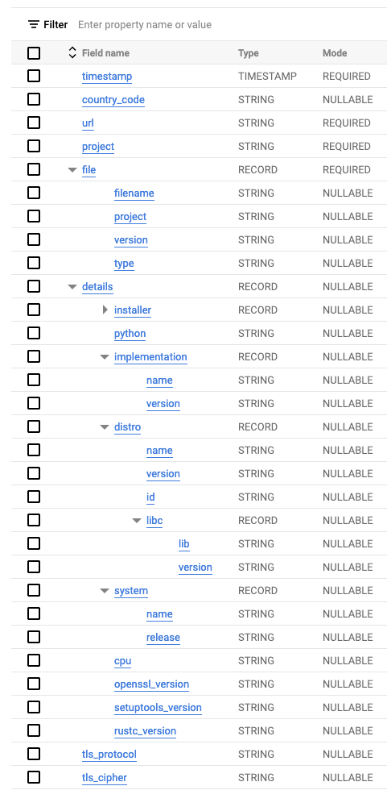
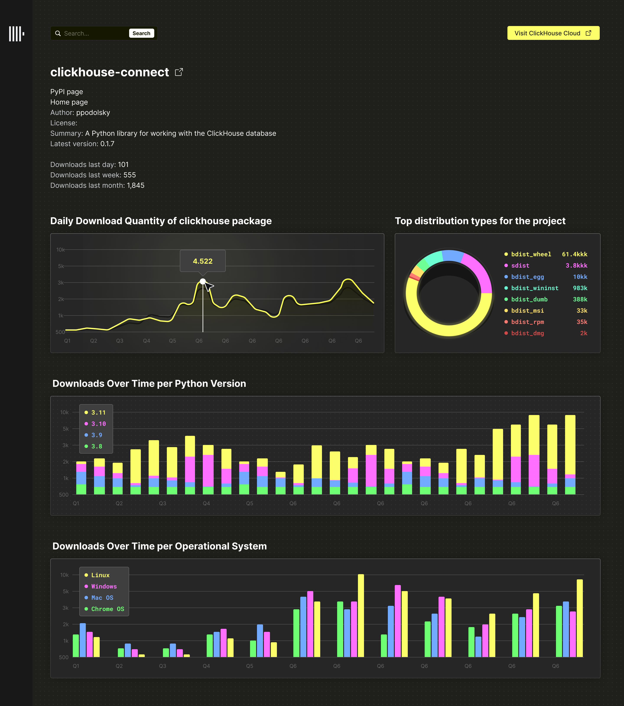

# ClickHouse vs Snowflake for Real-time Analytics

These tests were performed on ClickHouse 23.6 unless stated and the first 2 weeks of June for Snowflake.

A full report with the results of these benchmarks can be found [here]().

## Goals

To provide a real-time analytics benchmark comparing ClickHouse and Snowflake when resources are comparable and all effort is made to optimize both.

Goals similar to [ClickBench](https://github.com/ClickHouse/ClickBench#goals).

## Use case and dataset 

### Dataset

The PYPI dataset is currently available as a [public table in BigQuery.](https://packaging.python.org/en/latest/guides/analyzing-pypi-package-downloads/#id10)  Each row in this dataset represents the download of a python package by a user e.g. using pip. We have exported this data as Parquet files, making it available in the public gcs bucket `gcs://clickhouse_public_datasets/pypi/file_downloads`. The steps for this are available [here](https://pastila.nl/?001e53a9/e2bebfba9b6badf525a355868fdc3463). The original schema for this dataset is shown below. Due to the nested structures, Parquet was chosen as the optimal export format.



In order to provide a more usable subset for our tests, we exported only the last three months as of 23/06/2023. To [conform to Snowflake's best practices](https://www.snowflake.com/blog/best-practices-for-data-ingestion/) when loading Parquet files, we targeted file sizes between 100 MB and 150 MB. To achieve this, BigQuery requires the table to be copied and re-partitioned before exporting. Using the steps [here](https://pastila.nl/?001e53a9/e2bebfba9b6badf525a355868fdc3463), we were able to export 8.74TiB of data as 70608 files with an average size of 129 MB.

### Application

Analytics over such a large dataset would typically be challenging. We propose a simple service where users can enter a package name’s name and retrieve a selection of analytics, ideally rendered as charts, for the package. This includes, but is not limited to:

1. Downloads over time possibly render as a line chart.
2. Downloads over time per Python version, rendered as a multi-series line chart.
3. Downloads over time per system, e.g., Linux, rendered as a multi-series line chart.
4. Top distribution types for the project, e.g., [sdist or bdist](https://dev.to/icncsx/python-packaging-sdist-vs-bdist-5ekb), rendered as a pie or bar.

In addition, the application might allow the user to identify:

1. Total downloads for related sub-projects (if they exist) for a technology, e.g., [`clickhouse-connect`](https://github.com/ClickHouse/clickhouse-connect) for ClickHouse.
2. Top projects for a specific distro, e.g. Ubuntu.

This might look something like the following:



The above represents a straightforward real-time application with many enhancement possibilities. 

While real-time analytics applications are typically more complex than this, the above allows us to model the query workload fairly easily. 

Each of the above charts can be rendered with a simple SQL statement, requiring a project filter. Assuming we also allow the user to drill down on a date period, updating the charts, we can evaluate the query performance of both Snowflake and ClickHouse for this application.

In our benchmark, we model this workload in its simplest form:

- We devise a SQL query for each chart representing the initial rendering when a user types a project. 
- A subsequent query then filters the chart on a random date range. 
- Queries for both systems use the same dates and projects, executed in the same order for fairness. 
- We execute these queries with a single thread, one after another (focusing on absolute latency). 
- This does not test a workload with concurrent requests; neither does it test for system capacity. Every query is run only a few times, and this allows some variability in the results. A more accurate test would run the queries concurrently, thus replicating user behavior more precisely. We keep queries single-threaded for simplicity and to focus on latency.


## Limitations

The benchmark represents a specific workload to power a real-time analytics application using a single table. The following limitations should be acknowledged:

* The dataset is represented by one flat table. Snowflake may be better when using multiple tables and joins.
* The table consists of 65 billion records. This is rather moderate by modern standards but allows tests to be performed in a reasonable time (and Snowflake credit cost!). The full PYPI dataset is 570 billion records as of June 2023. We encourage anyone with sufficient finance to run this test!
* The test has been exclusively tested on Snowflake and ClickHouse Cloud - both of which are multi-node and serverless cloud-native setups. Performance may vary on self-managed ClickHouse nodes.
* The benchmark runs queries one after another (focusing on absolute latency) and does not test a workload with concurrent requests; neither does it test for system capacity. Every query is run only a few times, and this allows some variability in the results. A more accurate test would run the queries concurrently, thus replicating user behavior more precisely. We keep queries single-threaded for simplicity and to focus on latency, deferring concurrency to later testing. Given our benchmark does not consider concurrency, we have also not looked at Snowflake's multi-cluster support. This is designed to [address scaling of query throughput](https://docs.snowflake.com/en/user-guide/warehouses-multicluster#benefits-of-multi-cluster-warehouses) and not latency and is thus not relevant to our workload.
* While we have tried to keep resources comparable, ClickHouse Cloud and Snowflake utilize different node sizes and CPU-to-memory ratios. This invariably contributes to differences in query latency. We have focused on trying to keep total CPU comparable, giving Snowflake the advantage where possible. We do not expect any queries to be memory intensive - although ClickHouse Cloud often has the advantage with respect to this dimension. We use a production instance of a ClickHouse Cloud service for our examples with a total of 177, 240, or 256 vCPUs. For Snowflake, we have predominantly used either a 2XLARGE or 4XLARGER cluster, possessing 256 and 512 vCPUs, respectively - the former representing the closest configuration to the above ClickHouse specification. These configurations can be expensive - loading the dataset itself is around $1500 in Snowflake before clustering optimizations are applied. Users can again choose to load subsets to reduce this cost and/or run a limited number of benchmarks.
* While the above configurations provide an obvious compute advantage over the above ClickHouse cluster, ClickHouse has a greater CPU-to-memory ratio, offsetting some of this advantage. We have attempted to avoid memory-intensive queries as a result but acknowledge these differences make full comparison challenging. Other differences include local disk sizes, causing variability in FS caching.
* For our benchmarks, we assume the data is static. In reality, we would need to insert data into ClickHouse and Snowflake for recent downloads continuously. We defer this to a later exercise. With around 800 million downloads per day, we wouldn't expect inserts to measurably impact Snowflake's or ClickHouse's performance if batch loaded.
* Although not formally documented, we assume each Snowflake unit is equivalent to 8 vCPUs and 16GB RAM, e.g., a small warehouse of 2 units thus has 16 vCPUs and 32GB of RAM. This appears to be [well understood](https://select.dev/posts/snowflake-warehouse-sizing) and a reasonable assumption.
* Given this benchmark does not consider concurrency, we have also not tested Snowflake’s multi-cluster support. This is designed to address scaling of query throughput, and not latency, and is thus not relevant to our workload.

Ultimately, the goal of the benchmark is to give the numbers for comparison and let you derive the conclusions on your own.

## Schemas and data loading

### ClickHouse

```sql
CREATE TABLE default.pypi
(
    `timestamp` DateTime64(6),
    `date` Date MATERIALIZED timestamp,
    `country_code` LowCardinality(String),
    `url` String,
    `project` String,
    `file` Tuple(filename String, project String, version String, type Enum8('bdist_wheel' = 0, 'sdist' = 1, 'bdist_egg' = 2, 'bdist_wininst' = 3, 'bdist_dumb' = 4, 'bdist_msi' = 5, 'bdist_rpm' = 6, 'bdist_dmg' = 7)),
    `installer` Tuple(name LowCardinality(String), version LowCardinality(String)),
    `python` LowCardinality(String),
    `implementation` Tuple(name LowCardinality(String), version LowCardinality(String)),
    `distro` Tuple(name LowCardinality(String), version LowCardinality(String), id LowCardinality(String), libc Tuple(lib Enum8('' = 0, 'glibc' = 1, 'libc' = 2), version LowCardinality(String))),
    `system` Tuple(name LowCardinality(String), release String),
    `cpu` LowCardinality(String),
    `openssl_version` LowCardinality(String),
    `setuptools_version` LowCardinality(String),
    `rustc_version` LowCardinality(String),
    `tls_protocol` Enum8('TLSv1.2' = 0, 'TLSv1.3' = 1),
    `tls_cipher` Enum8('ECDHE-RSA-AES128-GCM-SHA256' = 0, 'ECDHE-RSA-CHACHA20-POLY1305' = 1, 'ECDHE-RSA-AES128-SHA256' = 2, 'TLS_AES_256_GCM_SHA384' = 3, 'AES128-GCM-SHA256' = 4, 'TLS_AES_128_GCM_SHA256' = 5, 'ECDHE-RSA-AES256-GCM-SHA384' = 6, 'AES128-SHA' = 7, 'ECDHE-RSA-AES128-SHA' = 8)
)
ENGINE = MergeTree
ORDER BY (project, date, timestamp)

INSERT INTO pypi
SELECT
    timestamp,
    country_code,
    url,
    project,
    (ifNull(file.filename, ''), ifNull(file.project, ''), ifNull(file.version, ''), ifNull(file.type, '')) AS file,
    (ifNull(installer.name, ''), ifNull(installer.version, '')) AS installer,
    python AS python,
    (ifNull(implementation.name, ''), ifNull(implementation.version, '')) AS implementation,
    (ifNull(distro.name, ''), ifNull(distro.version, ''), ifNull(distro.id, ''), (ifNull(distro.libc.lib, ''), ifNull(distro.libc.version, ''))) AS distro,
    (ifNull(system.name, ''), ifNull(system.release, '')) AS system,
    cpu AS cpu,
    openssl_version AS openssl_version,
    setuptools_version AS setuptools_version,
    rustc_version AS rustc_version,
    tls_protocol,
    tls_cipher
FROM s3Cluster('default', 'https://storage.googleapis.com/clickhouse_public_datasets/pypi/file_downloads/sample/2023/*.parquet', 'Parquet', 'timestamp DateTime64(6), country_code LowCardinality(String), url String, project String, `file.filename` String, `file.project` String, `file.version` String, `file.type` String, `installer.name` String, `installer.version` String, python String, `implementation.name` String, `implementation.version` String, `distro.name` String, `distro.version` String, `distro.id` String, `distro.libc.lib` String, `distro.libc.version` String, `system.name` String, `system.release` String, cpu String, openssl_version String, setuptools_version String, rustc_version String,tls_protocol String, tls_cipher String')
SETTINGS input_format_null_as_default = 1, input_format_parquet_import_nested = 1, max_insert_block_size = 100000000, min_insert_block_size_rows = 100000000, min_insert_block_size_bytes = 500000000, parts_to_throw_insert = 50000, max_insert_threads = 16, parallel_distributed_insert_select=2
```

See specific sub folders for potential schema optimizations for each query type.


### Snowflake

```sql
-- use account admin
USE ROLE ACCOUNTADMIN;
-- create database
CREATE DATABASE PYPI
-- transient tables as we don't need time travel
create  TRANSIENT schema PYPI DATA_RETENTION_TIME_IN_DAYS = 0;
-- create file format
CREATE FILE FORMAT my_pypi_format TYPE = parquet;
-- connect to gcs
CREATE STORAGE INTEGRATION gcs_int
  TYPE = EXTERNAL_STAGE
  STORAGE_PROVIDER = 'GCS'
  ENABLED = TRUE
  STORAGE_ALLOWED_LOCATIONS = ('gcs://clickhouse_public_datasets/');
-- create staging area for test data
create stage PYPI_STAGE_SAMPLE
  url='gcs://clickhouse_public_datasets/pypi/file_downloads/sample/2023'
  storage_integration = gcs_int
  file_format = my_pypi_format;
-- create table (transient as no time travel needed)
CREATE TRANSIENT TABLE PYPI (
    timestamp TIMESTAMP,
    country_code varchar,
    url varchar,
    project varchar,
    file OBJECT,
    installer OBJECT,
    python varchar,
    implementation OBJECT,
    distro VARIANT,
    system OBJECT,
    cpu varchar,
    openssl_version varchar,
    setuptools_version varchar,
    rustc_version varchar,
    tls_protocol varchar,
    tls_cipher varchar 
) DATA_RETENTION_TIME_IN_DAYS = 0;

-- use a warehouse - loading performance is linear so use as large as possible at no extra cost
USE WAREHOUSE "<warehouse>";
-- load data
copy into PYPI from (select
    to_timestamp($1:timestamp::varchar) as timestamp,
    $1:country_code         as country_code,
    $1:url            as url,
    $1:project            as project,
    $1:file            as file,
        $1:installer            as installer,
    $1:python             as python,
    $1:implementation            as implementation,
    $1:distro            as distro,
    $1:system       as system,
    $1:cpu            as cpu,
    $1:openssl_version      as openssl_version,
    $1:setuptools_version          as setuptools_version,

    $1:rustc_version         as rustc_version,
    $1:tls_protocol    as tls_protocol,
    $1:tls_cipher     as tls_cipher
    from @PYPI_STAGE_SAMPLE)
pattern= 'pypi/file_downloads/sample/2023/file_downloads.*'

-- disable query cache
ALTER USER <user> SET USE_CACHED_RESULT = false;
```

## Queries

### Generating queries

Requires a ClickHouse cluster with `pypi` data loaded. Generated queries are already available in sub folders.

Requires python 3.9+.

From the base folder:

```bash 
pip install -r requirements.txt
export CLICKHOUSE_HOST=localhost
export CLICKHOUSE_USER=default
export CLICKHOUSE_PASSWORD=
export CLICKHOUSE_PORT=8443

python generate-queries.py.
```

Queries will be generated into the sub folders, in files `clickhouse_queries.sql` and `snowflake_queries.sql` (see below).

### Queries

Queries consist of 6 different query types, each in their own folder, aimed at different configurations of ClickHouse and Snowflake. 

For each query type, a set of queries can be found in `clickhouse_queries.sql` and `snowflake_queries.sql` for ClickHouse and Snowflake respectively.

These files provide the default queries used for most configurations. If the queries need to be overwritten for a configuration, they can be found in a dedicated file with the prefix denoting the configuration e.g. `file_type_mv_clickhouse_queries.sql`. By default, the `clickhouse_queries.sql` and `snowflake_queries.sql` are used in tests. This can be overridden with he parameter `QUERY_FILE` - see [Running Tests](#running-tests).

**These custom queries are not generated and must be manually updated**.

If re-generating queries, users should ensure any custom queries are updated e.g. to use the same date ranges - thus representing a fair comparison.

#### Downloads per day

Aims to test rendering of a line chart showing downloads for a project over time. A time filter is in turn applied. This 2-step query process is repeated for a set of projects.

More [here](./downloads_per_day/README.md)

#### Downloads per day by python version

Aims to test rendering and filtering of a multi-series line chart showing downloads for a project over time. A time filter is in turn applied. This 2-step query process is repeated for a set of projects.

More [here](./downloads_per_day_by_python_version/README.md)

#### Downloads per day by system

Aims to test rendering and filtering of a multi-series line chart showing systems for a project over time. Similar to Downloads per day by python version but system is higher cardinality. 
This requires (makes multi-series line chart usable) a sub-query to limit to the top 10 systems for the project.

More [here](./downloads_per_day_by_system/README.md)

#### Top file types per project

Aims to test rendering and filtering of a pie-chart showing file types for a project. This test aggregates file types for the last 90 days for a specific project, before applying a more specific time filter.

More [here](./top_file_type_per_project/README.md)

#### Top projects by distro

Aims to test building a pie chart where filtering is performed a non-primary key (`distro.name`). The focus here is performance when filtering by a non-clustered or ordered column. This is not a complete linear scan, as we are still filtering by date/timestamp, but expected performance to be much slower. 

More [here](./top_projects_by_distro/README.md)

#### Top sub projects

Aims to test rendering and filtering of a pie chart showing sub-projects over time. Sub-projects are those that are related to a core technology e.g. `mysql`. These are identified by using `project ILIKE %<term>%`, where `<term`> is selected from a list. 

More [here](./top_sub_projects/README.md)

## Running tests

Each folder contains a specific query set, with a `queries.sql` for both databases.

### ClickHouse

```bash
# defaults
export CLICKHOUSE_HOST=localhost
export CLICKHOUSE_USER=default
export CLICKHOUSE_PASSWORD=
# optionally, leave unset in most cases
export QUERY_FILE=


./clickhouse.sh <folder> <cloud> <spec> <config>

e.g.

./clickhouse.sh downloads_per_day true "708_GB" "default"
```

Ensure any test runs are documented in the respective folders `README.md`, providing an explanation of the spec and config.

### Snowflake

Ensure [snowsql is installed and authenticated]() i.e. `snowsql` from the command line should connect to your account.

```bash
# defaults - assumes creation as documented above
export SNOWFLAKE_WAREHOUSE=2XLARGE
export SNOWFLAKE_ROLE=ACCOUNTADMIN
export SNOWFLAKE_DB=PYPI
export SNOWFLAKE_SCHEMA=PYPI
# optionally, leave unset in most cases
export SNOWFLAKE_CONNECTION=
export QUERY_FILE=

# use "spec" to specify warehouse size and "config" to specify any special config e.g. "clustering"
./snowflake.sh <folder> <spec> <config>

e.g.

./snowflake.sh downloads_per_day 2XLARGE "default"
```

Ensure any test runs are documented in the respective folders `README.md`, providing an explanation of the spec and config.

### Reproducing results

A summary page can be generated for each query set. Ensure you have run the tests for both ClickHouse and Snowflake and a results file has been generated for each.

```bash
./generate-results.sh <folder | query set> 
```

This will produce an `index.html` file in the target folder which can be opened in a browser.


