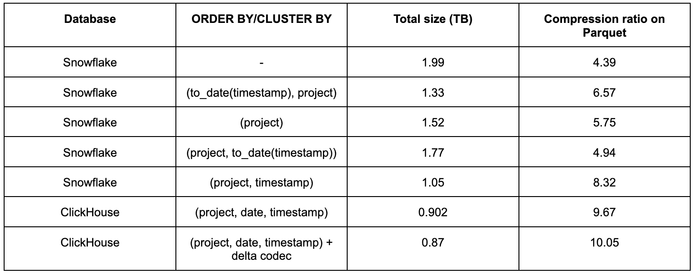
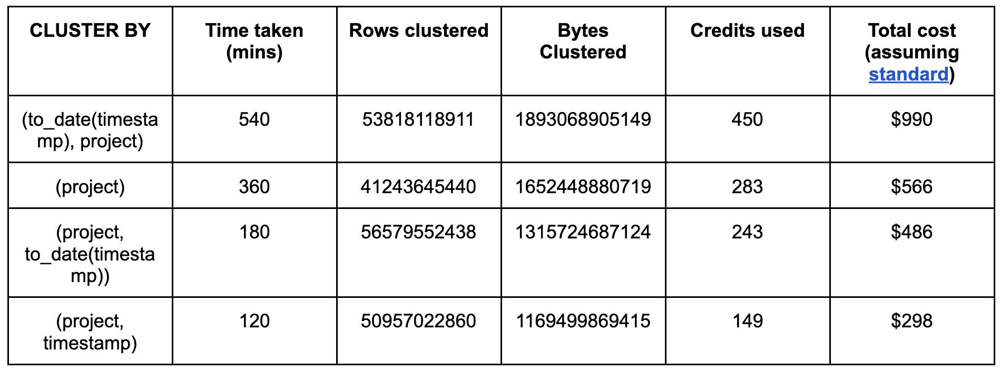

# Storage Efficiency and Compression

We use the same schemas here as described in our benchmarks for [Insert Performance](../insert_performance/README.md).

## Measuring compression

### ClickHouse
Total storage size in ClickHouse can be determined using the following query.

```sql
SELECT
	table,
	formatReadableSize(sum(data_compressed_bytes)) AS compressed_size,
	formatReadableSize(sum(data_uncompressed_bytes)) AS uncompressed_size,
	round(sum(data_uncompressed_bytes) / sum(data_compressed_bytes), 2) AS ratio
FROM system.columns
WHERE table = 'pypi'
GROUP BY table

┌─table─┬─compressed_size─┬─uncompressed_size─┬─ratio─┐
│ pypi  │ 922.88 GiB  	│ 14.62 TiB     	  │ 16.22 │
└───────┴─────────────────┴───────────────────┴───────┘
```

### Snowflake

For Snowflake, we utilize the `ACTIVE_BYTES` column from a similar query:

```sql
SELECT TABLE_NAME, ACTIVE_BYTES FROM INFORMATION_SCHEMA.TABLE_STORAGE_METRICS WHERE TABLE_NAME = 'PYPI' AND TABLE_SCHEMA = 'PYPI' AND ACTIVE_BYTES > 0;
| TABLE_NAME |  ACTIVE_BYTES |
|------------+---------------|
| PYPI   	| 2186865125376 |
+------------+---------------+
```

## Improving compression

Our earlier ClickHouse schema is mostly optimized for maximum compression. It can be further improved by applying a delta codec to the `date` and `timestamp` columns. This schema is shown below, has not used this for the majority of our testing. It also appears to be inferior to the original schema on cold queries.

```sql
CREATE TABLE default.pypi
(
   `timestamp` DateTime64(6) CODEC(Delta(8), ZSTD(1)),
   `date` Date MATERIALIZED timestamp CODEC(Delta(2), ZSTD(1)),
   `country_code` LowCardinality(String),
   `url` String,
   `project` String,
   `file` Tuple(filename String, project String, version String, type Enum8('bdist_wheel' = 0, 'sdist' = 1, 'bdist_egg' = 2, 'bdist_wininst' = 3, 'bdist_dumb' = 4, 'bdist_msi' = 5, 'bdist_rpm' = 6, 'bdist_dmg' = 7)),
   `installer` Tuple(name LowCardinality(String), version LowCardinality(String)),
   `python` LowCardinality(String),
   `implementation` Tuple(name LowCardinality(String), version LowCardinality(String)),
   `distro` Tuple(name LowCardinality(String), version LowCardinality(String), id LowCardinality(String), libc Tuple(lib Enum8('' = 0, 'glibc' = 1, 'libc' = 2), version LowCardinality(String))),
   `system` Tuple(name LowCardinality(String), release String),
   `cpu` LowCardinality(String),
   `openssl_version` LowCardinality(String),
   `setuptools_version` LowCardinality(String),
   `rustc_version` LowCardinality(String),
   `tls_protocol` Enum8('TLSv1.2' = 0, 'TLSv1.3' = 1),
   `tls_cipher` Enum8('ECDHE-RSA-AES128-GCM-SHA256' = 0, 'ECDHE-RSA-CHACHA20-POLY1305' = 1, 'ECDHE-RSA-AES128-SHA256' = 2, 'TLS_AES_256_GCM_SHA384' = 3, 'AES128-GCM-SHA256' = 4, 'TLS_AES_128_GCM_SHA256' = 5, 'ECDHE-RSA-AES256-GCM-SHA384' = 6, 'AES128-SHA' = 7, 'ECDHE-RSA-AES128-SHA' = 8)
)
ENGINE = MergeTree
ORDER BY (project, date, timestamp)
```

Our default Snowflake schema does not include clustering. This compression achievable by Snowflake is heavily impacted by this choice of key. We thus record the total size for various clustering keys below as well.

## Results



_Note that we were unable to identify an uncompressed size for Snowflake and are unable to provide a compression ratio similar to ClickHouse. We have thus computed a compression ratio to Parquet._

**Based on the selected Snowflake and ClickHouse configurations, ClickHouse outperforms Snowflake by around 38% in our tests.**

Observations:

- Clustering is Snowflake appears to be essential for good compression in our use case, reducing the data size by 40%. 
- Despite including an extra column `date`, **the best compression in ClickHouse is better than the most optimal Snowflake configuration by almost 20%**. The schema we use moving forward for most query benchmarks, without delta encoding on the `date` and `timestamp`, is still superior to Snowflake by 15%.
- Users will notice the best compression offered by Snowflake requires the use of the `timestamp` field in the `CLUSTER BY` clause. This is against Snowflake's recommendation of using a high cardinality key and generates a warning. This configuration, while offering good compression, also performed poorer with respect to query performance when compared to `todate(timestamp), project` on early tests. We have therefore selected the latter clustering key in subsequent tests and adhere to Snowflake recommendations.
- Users will also notice that the Snowflake clustering key is the opposite order to the ClickHouse ordering key i.e. `(to_date(timestamp), project)` to `project, date, timestamp`. This aligns with Snowflake best practices which recommends the lower cardinality column first (we have around 500k projects).

### Clustering time and costs

As described by the [Snowflake documentation](https://docs.snowflake.com/en/user-guide/tables-auto-reclustering#credit-usage-and-warehouses-for-automatic-clustering), clustering incurs tradeoffs. While improving query performance, users will be charged credits by the asynchronous service. We have attempted to capture the total credits (and cost) required for each of the above clustering keys below and the time taken for clustering to stabilize. Time consumed here is an estimate as Snowflake provides only hour-level granularity in its [AUTOMATIC_CLUSTERING_HISTORY view](https://docs.snowflake.com/en/user-guide/tables-auto-reclustering#viewing-automatic-clustering-cost). We use the following query to compute the results below:

```sql
SELECT DATABASE_NAME,
   	SCHEMA_NAME,
   	TABLE_NAME,
   	TIMEDIFF('minutes', min(start_time), max(end_time)) as time_spent,
   	sum(CREDITS_USED) AS total_credits,
   	max(NUM_ROWS_RE CLUSTERED) AS rows_clustered,
   	max(NUM_BYTES_RECLUSTERED) AS bytes_clustered
FROM snowflake.account_usage.automatic_clustering_history
GROUP BY 1, 2, 3;
```


