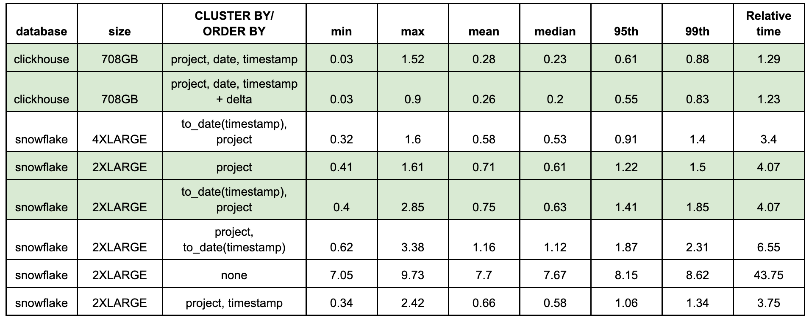
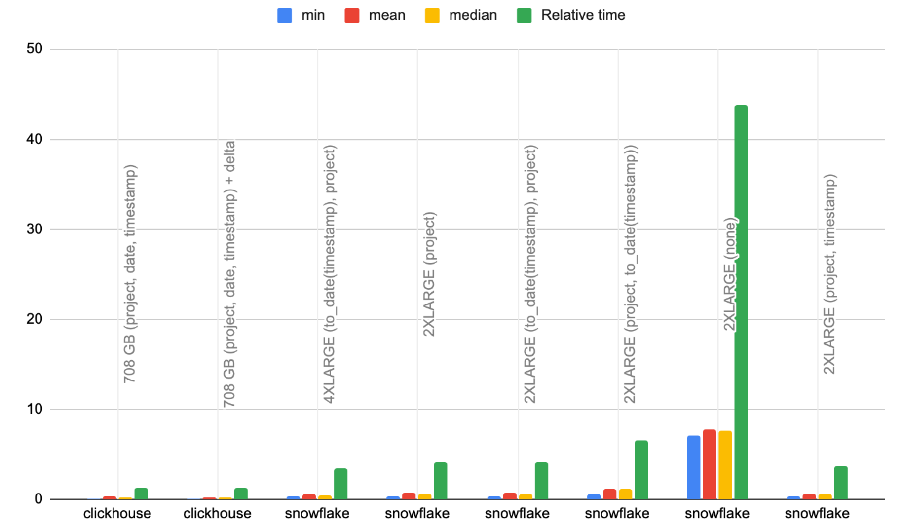
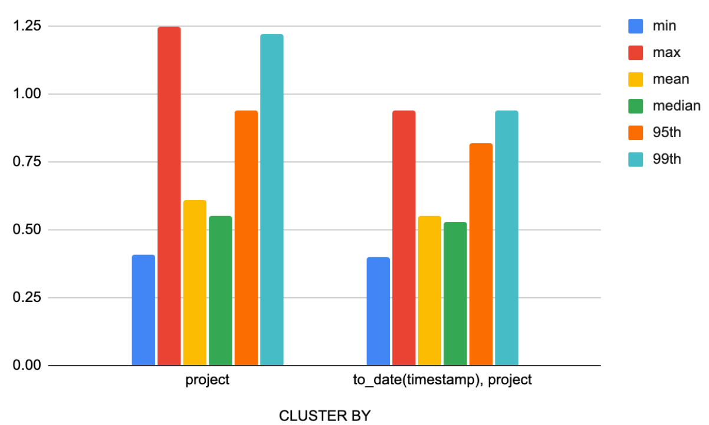
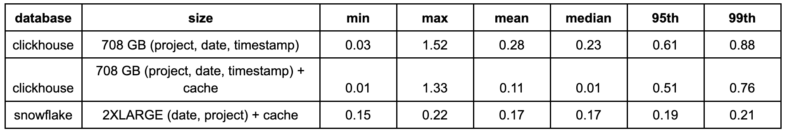
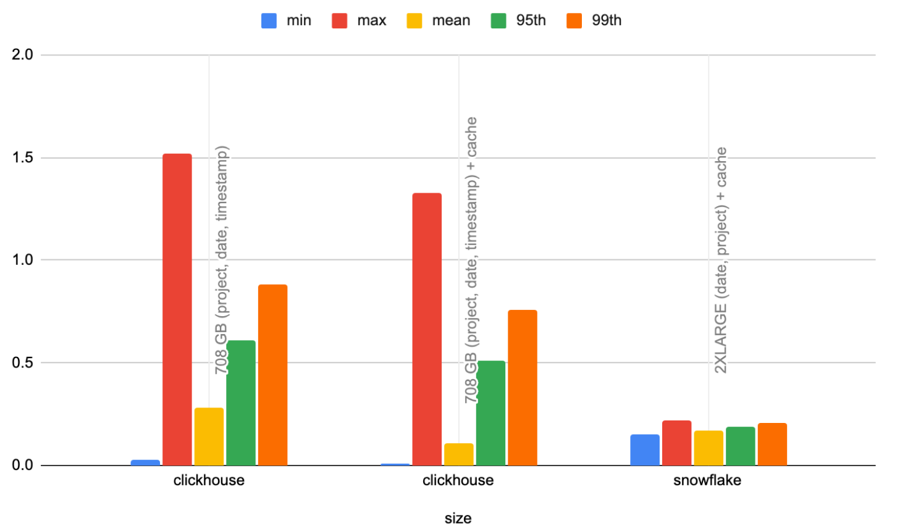
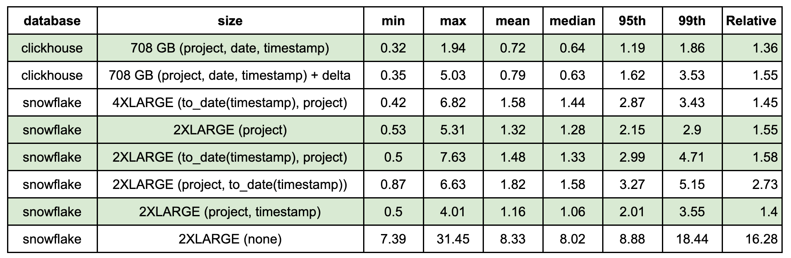
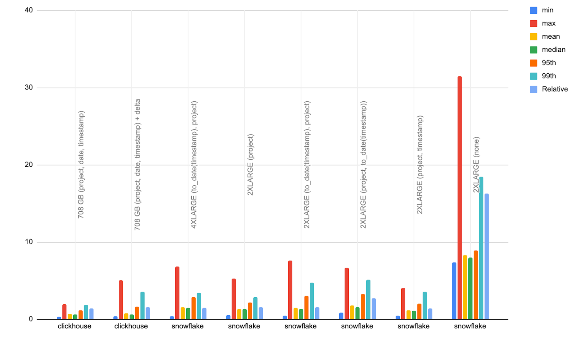

# Downloads Per Day

- Aims to test rendering and filtering of a line chart showing downloads for a project over time.
- This test aggregates downloads by day for the last 90 days, filtering by a project. A narrower time filter is then applied to a random time frame (same random values for both databases), grouping by an interval which produces around 100 buckets (so any chart points render sensibly).
- By default, this uses the 100 most popular projects, for a total of 200 queries.
- This simulates a user viewing an overview of downloads for a project (e.g. as a line chart) before drilling down on a timeframe.

## Queries 

## ClickHouse

```sql
-- per day downloads over 90 days with filtered project (varies)
SELECT
    toStartOfDay(date),
    count() AS count
FROM pypi
WHERE (project = 'typing-extensions') AND (date >= (CAST('2023-06-23', 'Date') - toIntervalDay(90)))
GROUP BY date
ORDER BY date ASC

-- random filter on time period using same project as above.
SELECT
    toStartOfInterval(timestamp, toIntervalSecond(34560)) AS period,
    count() AS count
FROM pypi
WHERE (project = 'typing-extensions') AND (date >= (CAST('2023-06-23', 'Date') - toIntervalDay(17))) AND (date <= (CAST('2023-06-23 08:33:59', 'Date') - toIntervalDay(9))) AND (timestamp >= (CAST('2023-06-23 08:33:59', 'DateTime') - toIntervalDay(17))) AND (timestamp <= (CAST('2023-06-23 08:33:59', 'DateTime') - toIntervalDay(9)))
GROUP BY period
ORDER BY period ASC
```

## Snowflake

```sql
-- per day downloads over 90 days with filtered project (varies)
SELECT DATE_TRUNC('DAY',timestamp) AS DAY,
       count(*) AS COUNT
FROM pypi
WHERE (project = 'typing-extensions')
  AND (timestamp > DATEADD(days, -90, '2023-06-23'::Date))
GROUP BY DAY
ORDER BY DAY ASC;

-- random filter on time period using same project as above.
SELECT TIME_SLICE(timestamp, 6912, 'SECOND', 'START') AS period,
       count(*)
FROM pypi
WHERE (project = 'typing-extensions')
  AND (timestamp >= DATEADD(days, -17, '2023-06-23 08:33:59'::DateTime))
  AND timestamp <= DATEADD(days, -9, '2023-06-23 08:33:59'::DateTime)
GROUP BY period
ORDER BY period ASC;
```

## Test configurations

All tests disable the query cache with `ALTER USER <user> SET USE_CACHED_RESULT = false;` unless stated. ClickHouse query cache is also disabled and file system cache dropped first.

|    Test Config     |                                                                        ClickHouse                                                                         |                                                  Snowflake                                                  |
|:------------------:|:---------------------------------------------------------------------------------------------------------------------------------------------------------:|:-----------------------------------------------------------------------------------------------------------:|
|      default       | Default table configuration and schema for ClickHouse with  `ORDER BY (project, date, timestamp)`. No secondary index, materialized views or projections. |                    Default table config and schema. No clustering or materialized views.                    |
| default_with_delta |                                              Same as default but delta encodec on timestamp and date fields                                               |                                                     NA                                                      |
|      project_cluster       |                                                                            NA                                                                             |                     CLUSTER BY (project). Automatic clustering allowed to take effect.                      |
|    date_project_cluster    |                                                                            NA                                                                             |            CLUSTER BY (to_date(timestamp), project). Automatic clustering allowed to take effect            |
| project_timestamp_cluster  |                                                                            NA                                                                             |                CLUSTER BY (project, timestamp). Automatic clustering allowed to take effect                 |
|    project_date_cluster    |                                                                            NA                                                                             |              CLUSTER BY (to_date(timestamp) date). Automatic clustering allowed to take effect              |
| date_project_cluster_cache |                                                                            NA                                                                             | CLUSTER BY (to_date(timestamp), project). Automatic clustering allowed to take effect and **cache** enabled |
|       default_cache        |                                         Default configuration with query cache enabled - see [Caching](#caching)                                          |                                                     NA                                                      |


## Optimizations

### Snowflake

#### Clustering

Adding clustering keys according to [guidelines](https://docs.snowflake.com/en/user-guide/tables-clustering-keys) e.g.

```sql
-- define table with clustering
CREATE TRANSIENT TABLE PYPI (
    timestamp TIMESTAMP,
    country_code varchar,
    url varchar,
    project varchar,
    file OBJECT,
    installer OBJECT,
    python varchar,
    implementation OBJECT,
    distro VARIANT,
    system OBJECT,
    cpu varchar,
    openssl_version varchar,
    setuptools_version varchar,
    rustc_version varchar,
    tls_protocol varchar,
    tls_cipher varchar 
) DATA_RETENTION_TIME_IN_DAYS = 0 CLUSTER BY (project, to_date(timestamp));

-- OR change clustering

ALTER TABLE PYPI CLUSTER BY (to_date(timestamp), project);
```

We allow clustering to take effect. This is achieved through [automatic clustering](https://docs.snowflake.com/en/user-guide/tables-auto-reclustering#viewing-automatic-clustering-cost). Monitor via:

```sql
SELECT TO_DATE(start_time) AS date,
  database_name,
  schema_name,
  table_name,
  SUM(credits_used) AS credits_used
FROM snowflake.account_usage.automatic_clustering_history
WHERE start_time >= DATEADD(month,-1,CURRENT_TIMESTAMP())
GROUP BY 1,2,3,4
ORDER BY 5 DESC;
```

### ClickHouse

#### Use of date field


The default configuration materializes the `date` field as a column which is included in the primary key. This reduces the amount of data to be read by 1/4 as filtering is first performed on `date` (2 bytes per value) and then `timestamp` (4 bytes per value).

#### Caching

To compare to Snowflake's cached result we can enable the [query cache](https://clickhouse.com/docs/en/operations/query-cache) in ClickHouse. Do this by setting the following environment variable prior to running tests.

```bash
export CLICKHOUSE_SETTINGS="use_query_cache = true, query_cache_min_query_duration = 0, query_cache_min_query_runs = 0,query_cache_ttl = 3600"
```

#### Delta codec

Applied to `timestamp` and `date` field to reduce storage i.e.

```sql
CREATE TABLE pypi
(
    `timestamp` DateTime64(6) CODEC(Delta, ZSTD),
    `date` Date MATERIALIZED timestamp CODEC(Delta, ZSTD),
    `country_code` LowCardinality(String),
    `url` String,
    `project` String,
    `file` Tuple(filename String, project String, version String, type Enum8('bdist_wheel' = 0, 'sdist' = 1, 'bdist_egg' = 2, 'bdist_wininst' = 3, 'bdist_dumb' = 4, 'bdist_msi' = 5, 'bdist_rpm' = 6, 'bdist_dmg' = 7)),
    `installer` Tuple(name LowCardinality(String), version LowCardinality(String)),
    `python` LowCardinality(String),
    `implementation` Tuple(name LowCardinality(String), version LowCardinality(String)),
    `distro` Tuple(name LowCardinality(String), version LowCardinality(String), id LowCardinality(String), libc Tuple(lib Enum8('' = 0, 'glibc' = 1, 'libc' = 2), version LowCardinality(String))),
    `system` Tuple(name LowCardinality(String), release String),
    `cpu` LowCardinality(String),
    `openssl_version` LowCardinality(String),
    `setuptools_version` LowCardinality(String),
    `rustc_version` LowCardinality(String),
    `tls_protocol` Enum8('TLSv1.2' = 0, 'TLSv1.3' = 1),
    `tls_cipher` Enum8('ECDHE-RSA-AES128-GCM-SHA256' = 0, 'ECDHE-RSA-CHACHA20-POLY1305' = 1, 'ECDHE-RSA-AES128-SHA256' = 2, 'TLS_AES_256_GCM_SHA384' = 3, 'AES128-GCM-SHA256' = 4, 'TLS_AES_128_GCM_SHA256' = 5, 'ECDHE-RSA-AES256-GCM-SHA384' = 6, 'AES128-SHA' = 7, 'ECDHE-RSA-AES128-SHA' = 8)
)
ENGINE = ReplicatedMergeTree
ORDER BY (project, date, timestamp)
```

## Results

Full results [here](./results).

### Hot queries

The results are summarized below for hot queries (all timings in seconds and best performing highlighted):



Relative time here is a measure of the average performance relative to the best response time, across all configurations and queries. 




Observations:

- Clustering is clearly critical to Snowflake performance for real-time analytics, with an average response time and relative performance of 7s and 44x for non-clustered performance. 
- For clusters with comparable resources, ClickHouse outperforms Snowflake by at least 3x on the mean and 2x on the 95th and 99th percentile. 
- ClickHouse with 177 cores even outperforms a 4XLARGE Snowflake warehouse with 1024 cores. This suggests our specific workload gains no benefit from no further parallelization.  

The use of the single clustering key `project` also offers marginally better performance than `project, to_date(timestamp)` despite poorer compression. This can be attributed to faster performance on only the initial query for each project, which queries the entire 90 days. Drill down queries are slower, as shown below, if we limit analysis to only the 2nd drill-down query for each project. 

 

### Caching performance

Results for Snowflake’s query cache vs ClickHouse’s equivalent feature.





Observations:

- While the ClickHouse cache delivers a faster mean response time, Snowflake does provide a better distribution of values with lower 95th, 99th and max values. We attribute this to ClickHouse’s cache being local to each node and load balancing of queries i.e. we provide no guarantee a query is serviced by node on which it has been cached already. 
- Snowflake likely benefits here from having a distributed cache at its service layer, independent of the nodes. While this may deliver a slightly high mean response time, it is more consistent in its performance. 
- In a production scenario changing data would invalidate these cache benefits in most real-time analytics use cases.

### Cold performance

In real-time analytics use cases, cache misses are inevitable and often the cause of 95th and 99th percentile outliers. In this case, ClickHouse Cloud benefits from greater memory to cpu ratio as well as higher compression - both helping to keep more of the data local to the nodes and resulting in faster response times. This is confirmed if we look at cold queries only:





Observations:

- For cold queries, ClickHouse clearly outperforms Snowflake by 1.5 to 2x depending on the metric. 
- Our Snowflake project only key again performs favorably for the initial full date range queries, slightly skewing the metrics. (project, timestamp) also performs well for cold queries (unlike hot queries) despite being against Snowflake best practices.
- The use of the delta codec in the ClickHouse schema appears to negatively impact cold performance.
