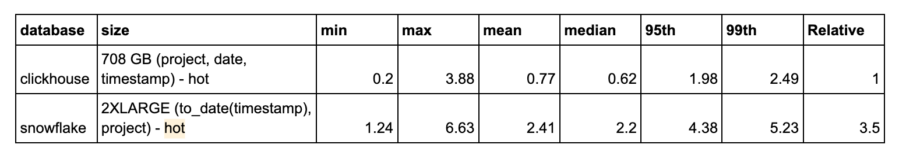
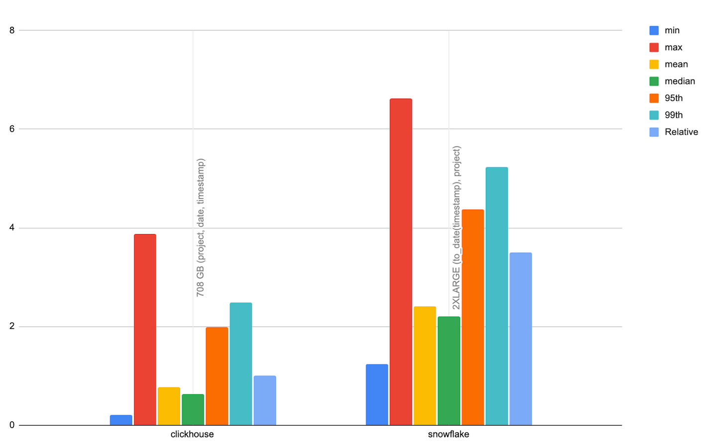
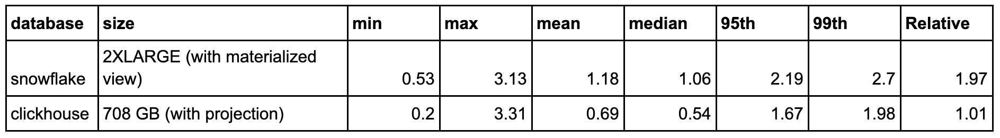
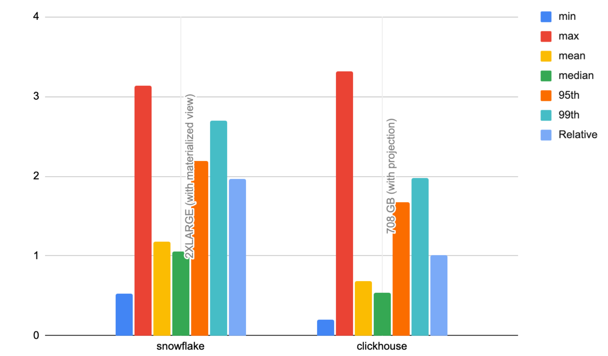

# Downloads per day by System

- Aims to test rendering and filtering of a multi-series line chart showing systems for a project over time. Similar to [Downloads per day by Python version](../downloads_per_day_by_python_version) but system is higher cardinality.
- This test aggregates downloads by day for the last 90 days, grouping by system and filtering by a project. The higher cardinality of system requires us to filter by the top 10 values for each project - this is achieved though a sub-query. 
- A narrower time filter is then applied to a random time frame (same random values for both databases).
- By default, this uses the 100 most popular projects, for a total of 200 queries.
- This simulates a user viewing an overview of downloads for a project grouped by system (e.g. as a multi-series line chart) before drilling down on a timeframe.


## Queries 

## ClickHouse

```sql
-- per day downloads by top 10 systems over 90 days with filtered project (varies)
SELECT
    date AS day,
    system.name AS system,
    count() AS count
FROM pypi
WHERE (project = 'boto3') AND (date >= (CAST('2023-06-23', 'Date') - toIntervalDay(90))) AND (system IN (
    -- sub query reading top 10 systems for the project
    SELECT system.name AS system
    FROM pypi
    WHERE (system != '') AND (project = 'boto3')
    GROUP BY system
    ORDER BY count() DESC
    LIMIT 10
))
GROUP BY
    day,
    system
ORDER BY
    day ASC,
    count DESC

-- random filter on time period using same project as above.
SELECT
    toStartOfInterval(timestamp, toIntervalSecond(38880)) AS period,
    count() AS count,
    system.name AS system
FROM pypi
WHERE (project = 'boto3') AND (date >= (CAST('2023-06-23', 'Date') - toIntervalDay(84))) AND (date <= (CAST('2023-06-23', 'Date') - toIntervalDay(39))) AND (timestamp >= (CAST('2023-06-23 08:33:59', 'DateTime') - toIntervalDay(84))) AND (timestamp <= (CAST('2023-06-23 08:33:59', 'DateTime') - toIntervalDay(39))) AND (system IN (
   -- sub query reading top 10 systems for the project
    SELECT system.name AS system
    FROM pypi
    WHERE (system != '') AND (project = 'boto3')
    GROUP BY system
    ORDER BY count() DESC
    LIMIT 10
))
GROUP BY
    period,
    system
ORDER BY
    period ASC,
    count DESC
```

## Snowflake

```sql
-- per day downloads by top 10 systems over 90 days with filtered project (varies)
SELECT DATE_TRUNC('DAY',timestamp) AS DAY,
       SYSTEM['name'] AS system_name,
             count(*) AS COUNT
FROM pypi
WHERE (project = 'boto3')
  AND (timestamp >= DATEADD(days, -90, '2023-06-23'::Date))
  AND system_name IN
  -- sub query reading top 10 systems for the project
    (SELECT SYSTEM['name'] AS system_name
     FROM pypi
     WHERE system_name != ''
       AND project = 'boto3'
     GROUP BY system_name
     ORDER BY count(*) DESC
     LIMIT 10)
GROUP BY DAY,
         system_name
ORDER BY DAY ASC, COUNT DESC;

-- random filter on time period using same project as above.
SELECT TIME_SLICE(timestamp, 38880, 'SECOND', 'START') AS period,
       SYSTEM['name'] AS system_name,
             count(*) AS c
FROM pypi
WHERE (project = 'boto3')
  AND (timestamp >= DATEADD(days, -84, '2023-06-23 08:33:59'::DateTime))
  AND timestamp <= DATEADD(days, -39, '2023-06-23 08:33:59'::DateTime)
  AND system_name IN
  -- sub query reading top 10 systems for the project
    (SELECT SYSTEM['name'] AS system_name
     FROM pypi
     WHERE system_name != ''
       AND (project = 'boto3')
     GROUP BY system_name
     ORDER BY count(*) DESC
     LIMIT 10)
GROUP BY period,
         system_name
ORDER BY period,
         c DESC;
```

## Test configurations

All tests disable the query cache with `ALTER USER <user> SET USE_CACHED_RESULT = false;` unless stated. ClickHouse query cache is also disabled and file system cache dropped first.

|     Test Config      |                                                                        ClickHouse                                                                         |                                                      Snowflake                                                      |
|:--------------------:|:---------------------------------------------------------------------------------------------------------------------------------------------------------:|:-------------------------------------------------------------------------------------------------------------------:|
|       default        | Default table configuration and schema for ClickHouse with  `ORDER BY (project, date, timestamp)`. No secondary index, materialized views or projections. |                        Default table config and schema. No clustering or materialized views.                        |
| date_project_cluster |                                                                            NA                                                                             |                CLUSTER ON (to_date(timestamp), project). Automatic clustering allowed to take effect                |
|    cnt_by_system     |                Projection for speeding up the subquery (see [Projection by project and system](#projection-by-project-and-system))                        | Materialized view for speeding up subquery. See [Materialized view for sub query](#materialized-view-for-sub-query) |


## Optimizations

The subquery identifying the top systems for a project is an ideal candidate to optimize with a projection in ClickHouse and materialized view in Snowflake. 
For both systems, this simply means using the query without a LIMIT. The count for each system by project will in turn be pre-computed, and in both cases automatically used as required when querying the original table.

### ClickHouse

#### Projection by project and system

Projection for speeding up the subquery.

```sql

ALTER TABLE pypi
    ADD PROJECTION prj_count_by_project_system
    (
        SELECT
            project,
            system.1 as system_name, -- doesn't work with system.name - known issue
            count() as c
        GROUP BY project, system_name
    );


ALTER TABLE pypi
    MATERIALIZE PROJECTION prj_count_by_project_system;
-- This will run asynchronously as a mutation.
-- This can take a while.
-- See further below for monitoring queries.

EXPLAIN indexes=1
SELECT
    date as day,
    system.name as system,
    count () AS count
FROM pypi
WHERE (project = 'boto3')
  AND (date >= '2023-06-23'::DateTime - toIntervalDay(90))
  AND system IN (
------------------------------------------
    SELECT
        system.1 as system -- important to use .1 instead of .name - otherwise projection is not used (known issue)
    FROM pypi_test1
    WHERE system != ''
      AND project = 'boto3'
    GROUP BY system
    ORDER BY count () DESC LIMIT 10)
------------------------------------------
GROUP BY day, system
ORDER BY day ASC, count DESC;

-- ┌─explain────────────────────────────────────────────────────────────────────────────────────────────────────────┐
-- │ CreatingSets (Create sets before main query execution)                                                         │
-- │   Expression (Projection)                                                                                      │
-- │     Sorting (Sorting for ORDER BY)                                                                             │
-- │       Expression (Before ORDER BY)                                                                             │
-- │         Aggregating                                                                                            │
-- │           Expression (Before GROUP BY)                                                                         │
-- │             Filter (WHERE)                                                                                     │
-- │               ReadFromMergeTree (default.pypi_test1)                                                           │
-- │               Indexes:                                                                                         │
-- │                 PrimaryKey                                                                                     │
-- │                   Keys:                                                                                        │
-- │                     project                                                                                    │
-- │                     date                                                                                       │
-- │                   Condition: and((_CAST(date) in [1679702400, +Inf)), (project in ['boto3', 'boto3']))         │
-- │                   Parts: 4/4                                                                                   │
-- │                   Granules: 11/122                                                                             │
-- │   CreatingSet (Create set for subquery)                                                                        │
-- │     Expression (Projection)                                                                                    │
-- │       Limit (preliminary LIMIT (without OFFSET))                                                               │
-- │         Sorting (Sorting for ORDER BY)                                                                         │
-- │           Expression (Before ORDER BY)                                                                         │
-- │             Aggregating                                                                                        │
-- │               Filter                                                                                           │
-- │                 ReadFromMergeTree (prj_count_by_project_system)                                                │
-- │                 Indexes:                                                                                       │
-- │                   PrimaryKey                                                                                   │
-- │                     Keys:                                                                                      │
-- │                       project                                                                                  │
-- │                       tupleElement(system, 1)                                                                  │
-- │                     Condition: and((project in ['boto3', 'boto3']), (tupleElement(system, 1) not in ['', ''])) │
-- │                     Parts: 4/4                                                                                 │
-- │                     Granules: 4/122                                                                            │
-- └────────────────────────────────────────────────────────────────────────────────────────────────────────────────┘

------------------------------------------------------------------------------------------------------
-- Monitor projection materialization progress
------------------------------------------------------------------------------------------------------
-- Eventually the projection will have the same number of parts as the source table.
-- This query checks and compares the number of parts:
WITH
    'default' AS db_name,
    'pypi' AS table_name,
    'prj_count_by_project_system' AS projection_name,
    T1 AS
    (
        SELECT count() AS num_parts_table
        FROM clusterAllReplicas(default, system.parts)
        WHERE active AND (database = db_name) AND (table = table_name)
    ),
    T2 AS
    (
        SELECT count() AS num_parts_projection
        FROM clusterAllReplicas(default, system.projection_parts)
        WHERE active AND (database = db_name) AND (table = table_name) AND (name = projection_name)
    )
SELECT
    num_parts_table,
    num_parts_projection,
    concat(CAST(round((100 / num_parts_table) * num_parts_projection, 0), 'String'), '%') AS progress
FROM T1, T2;

-- ┌─num_parts_table─┬─num_parts_projection─┬─progress─┐
-- │              78 │                   21 │ 27%      │
-- └─────────────────┴──────────────────────┴──────────┘


-- you can also check the is_done status of the mutation(s):
WITH
    'default' AS db_name,
    'pypi' AS table_name
SELECT
    hostName() AS host_name,
    is_done,
    command,
    create_time
FROM clusterAllReplicas(default, system.mutations)
WHERE (database = db_name) AND (table = table_name)
ORDER BY create_time DESC

-- ┌─host_name─────────────┬─is_done─┬─command────────────────────────────────────────────┬─────────create_time─┐
-- │ c-plum-rq-62-server-2 │       0 │ MATERIALIZE PROJECTION prj_count_by_project_system │ 2023-06-28 16:09:11 │
-- └───────────────────────┴─────────┴────────────────────────────────────────────────────┴─────────────────────┘
-- ┌─host_name─────────────┬─is_done─┬─command────────────────────────────────────────────┬─────────create_time─┐
-- │ c-plum-rq-62-server-0 │       0 │ MATERIALIZE PROJECTION prj_count_by_project_system │ 2023-06-28 16:09:11 │
-- └───────────────────────┴─────────┴────────────────────────────────────────────────────┴─────────────────────┘
-- ┌─host_name─────────────┬─is_done─┬─command────────────────────────────────────────────┬─────────create_time─┐
-- │ c-plum-rq-62-server-1 │       0 │ MATERIALIZE PROJECTION prj_count_by_project_system │ 2023-06-28 16:09:11 │
-- └───────────────────────┴─────────┴────────────────────────────────────────────────────┴─────────────────────┘

```

### Snowflake

The subquery identifying the top systems for a project is an ideal candidate to optimize with a projection in ClickHouse and materialized view in Snowflake. For both systems, this simply means using the query without a LIMIT. The count for each system by project will in turn be pre-computed, and in both cases automatically used as required when querying the original table. 

#### Materialized view for sub query

Materialized view for speeding up the subquery. Conceptually similar to above ClickHouse optimization.

```sql
CREATE OR REPLACE MATERIALIZED VIEW cnt_by_system AS SELECT project, system['name'] as system_name, count(*) as count FROM PYPI.PYPI.PYPI GROUP BY project, system_name;

ALTER MATERIALIZED VIEW cnt_by_system CLUSTER BY (project);
```

Note how we cluster our materialized view by project for optimal performance. This can take some time to take effect. Not this can incur additional credits in both maintenance and clustering.

_Adding system_name to the cluster key is not supported in Snowflake as the key of an OBJECT type. Given the small values, and filtering by project only, this is also unnecessary._

```sql
SELECT TO_DATE(start_time) AS date,
    database_name,
    schema_name,
    table_name,
    SUM(credits_used) AS credits_used
FROM snowflake.account_usage.materialized_view_refresh_history
WHERE start_time >= DATEADD(month,-1,CURRENT_TIMESTAMP())
GROUP BY 1,2,3,4
ORDER BY 5 DESC;

+------------+---------------+-------------+---------------+--------------+
| DATE       | DATABASE_NAME | SCHEMA_NAME | TABLE_NAME    | CREDITS_USED |
|------------+---------------+-------------+---------------+--------------|
| 2023-06-28 | PYPI          | PYPI        | CNT_BY_SYSTEM | 61.555391826 |
+------------+---------------+-------------+---------------+--------------+

SELECT TO_DATE(start_time) AS date,
    database_name,
    schema_name,
    table_name,
    SUM(credits_used) AS credits_used
FROM snowflake.account_usage.automatic_clustering_history
WHERE start_time >= DATEADD(month,-1,CURRENT_TIMESTAMP())
GROUP BY 1,2,3,4
ORDER BY 5 DESC;

+------------+---------------+-------------+---------------+---------------+
| DATE       | DATABASE_NAME | SCHEMA_NAME | TABLE_NAME    |  CREDITS_USED |
|------------+---------------+-------------+---------------+---------------|
| 2023-06-28 | PYPI          | PYPI        | CNT_BY_SYSTEM |   5.184381692 |
+------------+---------------+-------------+---------------+---------------+
1 Row(s) produced. Time Elapsed: 2.828s
```

To utilize the view we have modified the queries (see `cnt_by_system_snowflake_queries.sql`) to explicitly use the materialized view (it is probably possible to avoid this) - thus the test needs to be run using `export QUERY_FILE='cnt_by_system_snowflake_queries.sql''`.

## Results

Full results [here](./index.html).

### Hot queries





**ClickHouse is at least 2x faster across all metrics for this query.**

### Materialized views and projections

**Hot results only**





Observations:

- For ClickHouse the above optimization improves the mean by only 10%, but has a significant impact on the 95th and 99th percentile - reducing them by 15% and 20% respectively. 
- While Snowflake experiences an approximately 50% improvement across metrics, this is insufficient to overcome ClickHouse which is still around 1.5x faster.

