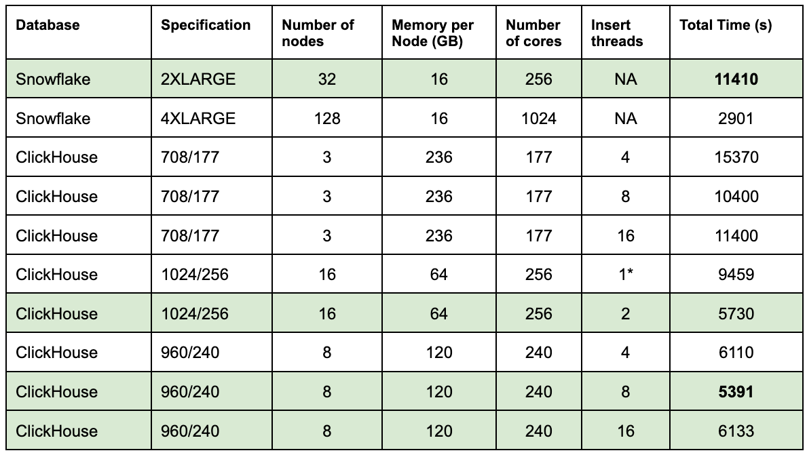

# Insert Performance

This test evaluates the insert performance into ClickHouse and Snowflake, using Parquet files located on GCS/S3.

## Assumptions

- the GCS bucket and Warehouse/Service are located in the same provider and region - GCE `us-central-1` in our case.
- In order to optimize insert performance, we have followed [Snowflakes best practices](https://docs.snowflake.com/en/user-guide/data-load-considerations-prepare) and kept Parquet files around 150MB.  

## Schemas

### ClickHouse

Our ClickHouse schema is shown below.

```sql
CREATE TABLE default.pypi
(
   `timestamp` DateTime64(6),
   `date` Date MATERIALIZED timestamp,
   `country_code` LowCardinality(String),
   `url` String,
   `project` String,
   `file` Tuple(filename String, project String, version String, type Enum8('bdist_wheel' = 0, 'sdist' = 1, 'bdist_egg' = 2, 'bdist_wininst' = 3, 'bdist_dumb' = 4, 'bdist_msi' = 5, 'bdist_rpm' = 6, 'bdist_dmg' = 7)),
   `installer` Tuple(name LowCardinality(String), version LowCardinality(String)),
   `python` LowCardinality(String),
   `implementation` Tuple(name LowCardinality(String), version LowCardinality(String)),
   `distro` Tuple(name LowCardinality(String), version LowCardinality(String), id LowCardinality(String), libc Tuple(lib Enum8('' = 0, 'glibc' = 1, 'libc' = 2), version LowCardinality(String))),
   `system` Tuple(name LowCardinality(String), release String),
   `cpu` LowCardinality(String),
   `openssl_version` LowCardinality(String),
   `setuptools_version` LowCardinality(String),
   `rustc_version` LowCardinality(String),
   `tls_protocol` Enum8('TLSv1.2' = 0, 'TLSv1.3' = 1),
   `tls_cipher` Enum8('ECDHE-RSA-AES128-GCM-SHA256' = 0, 'ECDHE-RSA-CHACHA20-POLY1305' = 1, 'ECDHE-RSA-AES128-SHA256' = 2, 'TLS_AES_256_GCM_SHA384' = 3, 'AES128-GCM-SHA256' = 4, 'TLS_AES_128_GCM_SHA256' = 5, 'ECDHE-RSA-AES256-GCM-SHA384' = 6, 'AES128-SHA' = 7, 'ECDHE-RSA-AES128-SHA' = 8)
)
ENGINE = MergeTree
ORDER BY (project, date, timestamp)
```

This represents an optimized schema with the use of the [Enum](https://clickhouse.com/docs/en/sql-reference/data-types/enum) and [LowCardinality](https://clickhouse.com/docs/en/sql-reference/data-types/lowcardinality) types to reduce storage overhead for columns with low cardinality. We have represented the nested structures `file`, `installer, `implementation`, and `distro` as named tuples. These are [hierarchical data structures](https://docs.snowflake.com/en/user-guide/semistructured-intro#what-is-hierarchical-data) (rather than fully semi-structured) and thus have predictable sub-columns. This allows us to apply the same type of optimizations as those applied to root columns.

The above schema also adds a materialized column `date` to the schema. This is not part of the raw data and has been added purely for use in the primary key and filter queries. Assuming a date and timestamp filter are applied to our query, the data will be first pruned using the sparse index. This will identify a set of [granules](https://clickhouse.com/docs/en/optimize/sparse-primary-indexes) for reading, which will be further filtered using a scan. Without the date column, this requires 8 bytes to be read for each timestamp value. If we introduce a date, however, this will be filtered first, costing only 2 bytes per value. This reduces our subsequent need to read the `timestamp` column, improving performance.

### Snowflake

Our Snowflake schema:

```sql
CREATE TRANSIENT TABLE PYPI (
   timestamp TIMESTAMP,
   country_code varchar,
   url varchar,
   project varchar,
   file OBJECT,
   installer OBJECT,
   python varchar,
   implementation OBJECT,
   distro VARIANT,
   system OBJECT,
   cpu varchar,
   openssl_version varchar,
   setuptools_version varchar,
   rustc_version varchar,
   tls_protocol varchar,
   tls_cipher varchar
) DATA_RETENTION_TIME_IN_DAYS = 0;
```

Our schema decisions are relatively simple above. Snowflake does not require varchar columns to have a limit specified, with no performance or storage penalty, simplifying the declaration significantly. We use the OBJECT type for the `file`, `installer`, `implementation`, and `system` columns as these will be effectively a JSON map-like structure. The `distro` column contains multiple levels of nesting, and hence we use the VARIANT type. We optimize the schema with two specific settings:

* We declare the table as [TRANSIENT](https://docs.snowflake.com/en/user-guide/tables-temp-transient#transient-tables). This disables Snowflake’s [fail-safe feature](https://docs.snowflake.com/en/user-guide/data-failsafe), which retains a copy of the data for seven days for emergency recovery, which is not required in our case and reduces costs. ClickHouse Cloud supports backups, providing a similar function - these are incorporated into the storage cost.
* We disable Snowflake’s [time travel feature](https://docs.snowflake.com/en/user-guide/data-time-travel), specifying a data retention of 0 days via the `DATA_RETENTION_TIME_IN_DAYS = 0`. This feature allows historical data to be accessed, i.e., data that has changed or been deleted within a defined period. This extremely powerful feature is not supported in ClickHouse and is less relevant to real-time analytics. 

By disabling the above features, we remove backups in Snowflake, which are automatically kept in ClickHouse Cloud for the last two days. While fine for testing, we do consider this in later cost analysis.

Initially we have not specified a clustering key but do in further experiments once data is loaded.

## Data Loading

### ClickHouse

The data can be loaded into ClickHouse with a simple `INSERT INTO SELECT`. In this case, we utilize the [s3Cluster](https://clickhouse.com/docs/en/sql-reference/table-functions/s3Cluster) function. While no credentials are required in this case, as the data is public for others to reproduce, secure access is supported either through [explicit passing of credentials ](https://clickhouse.com/docs/en/sql-reference/table-functions/s3)or [role sharing in ClickHouse Cloud](https://clickhouse.com/docs/en/cloud/manage/security/secure-s3).

```sql
INSERT INTO pypi
SELECT
	timestamp,
	country_code,
	url,
	project,
	(ifNull(file.filename, ''), ifNull(file.project, ''), ifNull(file.version, ''), ifNull(file.type, '')) AS file,
	(ifNull(installer.name, ''), ifNull(installer.version, '')) AS installer,
	python AS python,
	(ifNull(implementation.name, ''), ifNull(implementation.version, '')) AS implementation,
	(ifNull(distro.name, ''), ifNull(distro.version, ''), ifNull(distro.id, ''), (ifNull(distro.libc.lib, ''), ifNull(distro.libc.version, ''))) AS distro,
	(ifNull(system.name, ''), ifNull(system.release, '')) AS system,
	cpu,
	openssl_version,
	setuptools_version,
	rustc_version,
	tls_protocol,
	tls_cipher
FROM s3Cluster('default', 'https://storage.googleapis.com/clickhouse_public_datasets/pypi/file_downloads/2023/*.parquet', 'Parquet', 'timestamp DateTime64(6), country_code LowCardinality(String), url String, project String, `file.filename` String, `file.project` String, `file.version` String, `file.type` String, `installer.name` String, `installer.version` String, python String, `implementation.name` String, `implementation.version` String, `distro.name` String, `distro.version` String, `distro.id` String, `distro.libc.lib` String, `distro.libc.version` String, `system.name` String, `system.release` String, cpu String, openssl_version String, setuptools_version String, rustc_version String,tls_protocol String, tls_cipher String')
SETTINGS parallel_distributed_insert_select = 2, input_format_null_as_default = 1, input_format_parquet_import_nested = 1, max_insert_block_size = 100000000, min_insert_block_size_rows = 100000000, min_insert_block_size_bytes = 500000000, parts_to_throw_insert = 50000, max_insert_threads = N
```

The select query here transforms the columns from the Parquet file. As 23.6, we are required to perform `IfNull` checks on the nested columns to convert Null values to empty strings. This optimization is possible as our queries do not require the ability to identify the difference between a Null and default value. This saves storage space, given the [overhead of making a Nullable column is an additional UInt8 column](https://clickhouse.com/docs/en/cloud/bestpractices/avoid-nullable-columns). Future iterations of ClickHouse will likely do this for nested values via the parameter `input_format_null_as_default=1` (set above), which currently only applies to root columns.

For insert performance, we use the following settings:

* [`parallel_distributed_insert_select=2`](https://clickhouse.com/docs/en/operations/settings/settings#parallel_distributed_insert_select). This ensures that reads and subsequent inserts are distributed across all nodes in the cluster.
* [`max_insert_block_size=100000000`](https://clickhouse.com/docs/en/operations/settings/settings#settings-max_insert_block_size), [`min_insert_block_size_rows=100000000`](https://clickhouse.com/docs/en/operations/settings/settings#min-insert-block-size-rows), [`min_insert_block_size_bytes=500000000`](https://clickhouse.com/docs/en/operations/settings/settings#min-insert-block-size-bytes) to force larger block sizes on insert and [reduce the number of parts](https://clickhouse.com/docs/knowledgebase/exception-too-many-parts).
* [`parts_to_throw_insert=30000`](https://clickhouse.com/docs/en/operations/settings/merge-tree-settings#parts-to-throw-insert) - as inserts are performed, parts are formed on the disk. A higher rate of insert causes more parts to be created. Should this exceed a threshold (3000 by default in 23.6), insert errors will be thrown - a [“too many parts”](https://clickhouse.com/docs/knowledgebase/exception-too-many-parts) error. We increase this value when we set insert threads (see below) to a high value.
* [`max_insert_threads=N`](https://clickhouse.com/docs/en/operations/settings/settings#settings-max-insert-threads) - number of threads with which to perform inserts. Higher values increase insert performance at the expense of more memory and more parts.

While `max_insert_threads` and `parts_to_throw_insert` can potentially be set to high values to improve insert performance, this will cause the formation of a large number of parts which will, in turn, impact SELECT performance. These parts will eventually be merged in an asynchronous process, but query performance will be degraded until this occurs. We, therefore, keep the values lower to ensure data can be queried immediately.

### Snowflake

In order to optimize insert performance, we have followed [Snowflakes best practices](https://docs.snowflake.com/en/user-guide/data-load-considerations-prepare) and kept Parquet files around 150MB.  

Snowflake requires the user to create an [external stage](https://docs.snowflake.com/en/user-guide/data-load-s3-create-stage#external-stages). We do this using a [storage integration](https://docs.snowflake.com/en/user-guide/data-load-s3-config-storage-integration), which, while not required in this example, is needed if your data is not public.

```sql
-- create file format
CREATE FILE FORMAT my_pypi_format TYPE = parquet;
-- connect to gcs
CREATE STORAGE INTEGRATION gcs_int
  TYPE = EXTERNAL_STAGE
  STORAGE_PROVIDER = 'GCS'
  ENABLED = TRUE
  STORAGE_ALLOWED_LOCATIONS = ('gcs://clickhouse_public_datasets/');
-- create staging area for test data
create stage PYPI_STAGE_2023
  url='gcs://clickhouse_public_datasets/pypi/file_downloads/2023'
  storage_integration = gcs_int
  file_format = my_pypi_format;
-- copy files into table via stage
copy into PYPI from (select
	to_timestamp($1:timestamp::varchar) as timestamp,
	$1:country_code as country_code,
	$1:url as url,
	$1:project as project,
	$1:file as file,
    	$1:installer as installer,
	$1:python as python,
	$1:implementation as implementation,
	$1:distro as distro,
	$1:system as system,
	$1:cpu as cpu,
	$1:openssl_version as openssl_version,
	$1:setuptools_version as setuptools_version,
	$1:rustc_version as rustc_version,
	$1:tls_protocol	as tls_protocol,
	$1:tls_cipher 	as tls_cipher
	from @pypi_stage_2023)
pattern= 'pypi/file_downloads/2023/.*'
```

We perform a similar transformation as used for ClickHouse in our `copy into` statement. We are required to convert our timestamp, an integer in the Parquet file, into a timestamp via the `to_timestamp` function. Further details on the $ transformation syntax can be found [here](https://docs.snowflake.com/en/sql-reference/sql/copy-into-table#transformation-parameters).

## Results

In order to test the load performance of ClickHouse and Snowflake, we have tested a number of service and warehouse sizes of approximately the same total compute. In addition, we report the insert performance for ClickHouse with varying numbers of threads, the final number of parts and the time taken for merges to reduce the part count to under 300 (default recommended total).

**Number of files: 70608**

**Average file size: 129 MB**

**Total data size: 8.74TiB of data** 



Observations:

- On clusters with fewer nodes but with more cores per node, e.g. (708GB configuration), ClickHouse completes the initial insert operation faster. However, time is then spent merging parts below an acceptable threshold. This operation is single-threaded and thus bound by the number of nodes. We compare this time to Snowflake for a fair comparison and assume that Snowflake is ready for querying immediately - this will not be the case if clustering is also applied. However, if we spread our resources across more nodes (960GB has 8 x 30 core nodes), merges occur faster, resulting in a faster completion time. 
- Decreasing the threads for ClickHouse, while reducing the insert performance ensures the total parts are always close to 3000 and is likely preferable in most production settings - as illustrated by examples where the lower thread count is faster for the same hardware. We recommend users tune the `max_insert_threads` to values that keep parts manageable, thus avoiding the need to track post-insert. Furthermore, higher thread counts require more memory. This limits the total threads possible (although for reasons above to the detriment of total time) on configurations with lower memory per node.
- Snowflake does exhibit linear improvements in load time to the number of cores. This is commendable and means the total cost to the user remains constant, i.e., a 4XLARGE warehouse is twice the cost as a 2XLARGE, but the load time is half. The user can, in turn, make the warehouse idle on completion, incurring the same total charge.
- Snowflake appears to struggle with smaller parquet files which have not been optimally aligned with the recommended size of 150MB. The full PYPI dataset, consisting of over 1.5m files and 19 TiB, has a much smaller average file size of 13 MB. While ClickHouse is able to parallelize reads across these files and incurs no significant fall in performance, Snowflake proved considerably impacted.

The above timings do not include any clustering time for Snowflake. As shown below, this significantly impacts query performance. ClickHouse timings above include all costs to order the data and represent an optimal state. If clustering times are included, Snowflake is significantly slower - this is challenging to measure as clustering is asynchronous, and its scheduling is non-deterministic.

## Misc

Tracking the number of parts over time in ClickHouse can be achieved with the following query:

```sql
WITH 
    'default' AS db_name,
    'pypi' AS table_name,
    10 AS interval_minutes, -- NEED TO CHANGE FILL STEP accordingly - see WITH FILL STEP below
    (SELECT uuid FROM system.tables WHERE database = db_name and name = table_name) AS table_id, 
    (SELECT min(event_time) FROM system.part_log WHERE table_uuid = table_id) AS start_time,
    T1 AS (
        SELECT
            toStartOfInterval(event_time, toIntervalMinute(interval_minutes)) AS t,
            countIf(event_type != 'RemovePart') as add_events,
            countIf(event_type = 'RemovePart') as remove_events
        FROM
            system.part_log
        WHERE
            table_uuid = table_id
        GROUP BY
            t
        ORDER BY t ASC WITH FILL STEP (10 * 60)
    ),
    T2 AS (
        SELECT
            groupArray(t) AS t,
            groupArrayMovingSum(add_events) AS add_events,
            groupArrayMovingSum(remove_events) AS remove_events
        FROM T1
    ),
    T3 AS (
        SELECT
            t,
            arrayMap(e -> e.1 - e.2, arrayZip(add_events, remove_events)) as events
        FROM T2
    )
SELECT 
    -- t, 
    dateDiff('minute', toStartOfInterval(start_time, toIntervalMinute(interval_minutes)), t) AS min,
    events 
FROM T3
ARRAY JOIN
    t, 
    events
ORDER BY t ASC;
```
