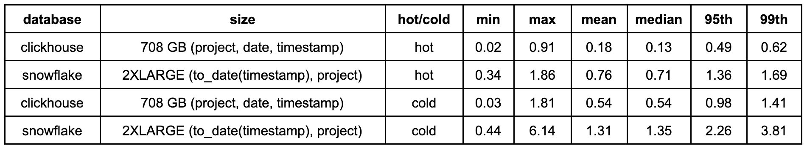
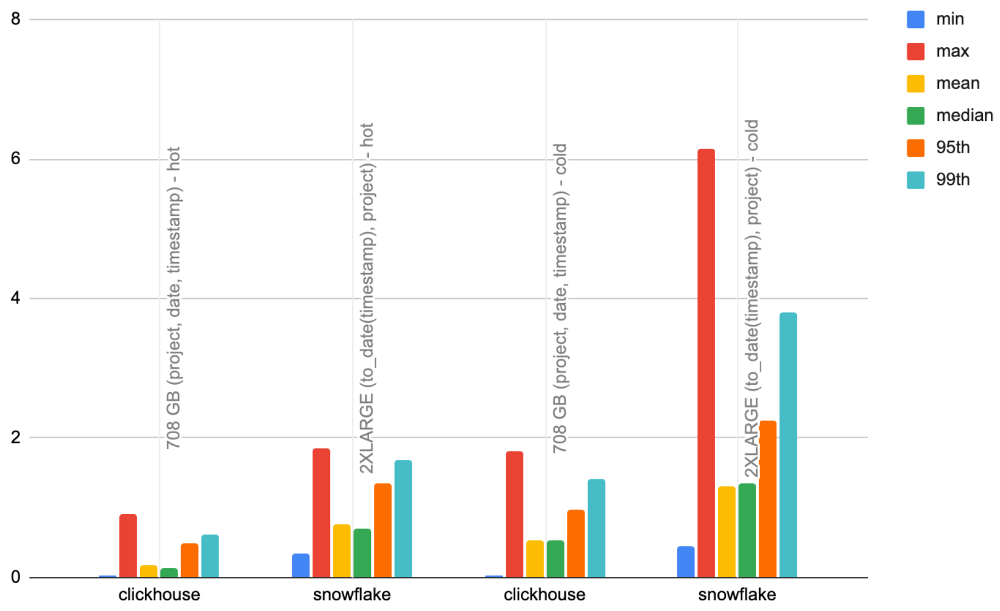
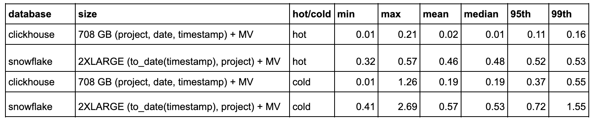
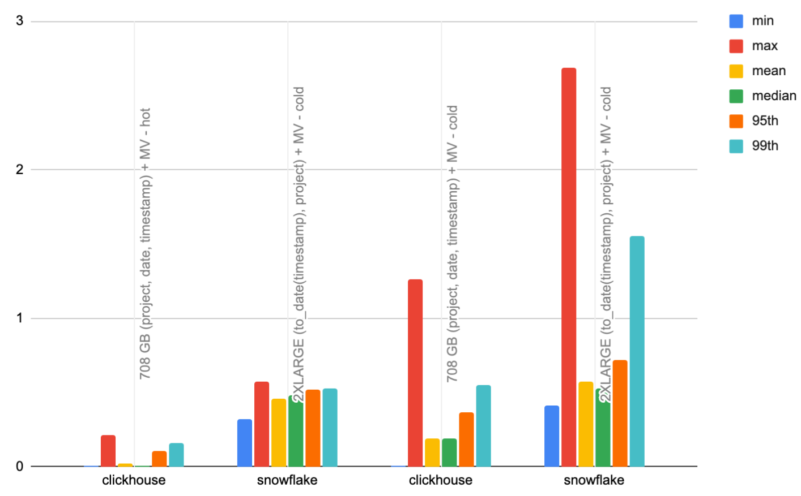

# Top file types by project

- Aims to test rendering and filtering of a pie-chart showing file types for a project.
- This test aggregates file types for the last 90 days for a specific project. 
- A narrower time filter is then applied to a random time frame (same random values for both databases). This time filter is limited to a day granularity, so we can exploit materialized views in ClickHouse and Snowflake.
- By default, this uses the 100 most popular projects, for a total of 200 queries.
- This simulates a user viewing an overview of file types for a project grouped (e.g. as a pie chart) before drilling down on a timeframe.

## Queries 

## ClickHouse

```sql
-- top file types for a specific project last 90 days
SELECT
    file.type,
    count() AS c
FROM pypi
WHERE (project = 'boto3') AND (date >= (CAST('2023-06-23', 'Date') - toIntervalDay(90)))
GROUP BY file.type
ORDER BY c DESC
LIMIT 10

-- above query but filtered
SELECT
    file.type,
    count() AS c
FROM pypi
WHERE (project = 'boto3') AND (date >= (CAST('2023-06-23', 'Date') - toIntervalDay(77))) AND (date <= (CAST('2023-06-23', 'Date') - toIntervalDay(39)))
GROUP BY file.type
ORDER BY c DESC
LIMIT 10
```

## Snowflake

```sql
-- top file types for a specific project last 90 days
SELECT FILE['type'], count(*) AS c
FROM pypi
WHERE project = 'boto3'
  AND (timestamp >= DATEADD(days, -90, '2023-06-23'::Date))
GROUP BY FILE['type']
ORDER BY c DESC
LIMIT 10;

-- above query but filtered
SELECT FILE['type'], count(*) AS c
FROM pypi
WHERE project = 'boto3'
  AND (timestamp::Date >= DATEADD(days, -77, '2023-06-23'::Date))
  AND timestamp::Date <= DATEADD(days, -39, '2023-06-23'::Date)
GROUP BY FILE['type']
ORDER BY c DESC
LIMIT 10;
```

## Test configurations

All tests disable the query cache with `ALTER USER <user> SET USE_CACHED_RESULT = false;` unless stated. ClickHouse query cache is also disabled and file system cache dropped first.

|      Test Config     |                                                                         ClickHouse                                                                         |                                       Snowflake                                       |
|:--------------------:|:----------------------------------------------------------------------------------------------------------------------------------------------------------:|:-------------------------------------------------------------------------------------:|
|        default       | Default table configuration and schema for ClickHouse with  `ORDER BY (project, date, timestamp)`. No secondary index, materialized views or projections.  |         Default table config and schema. No clustering or materialized views.         |
| date_project_cluster |                                                                             NA                                                                             | CLUSTER ON (to_date(timestamp), project). Automatic clustering allowed to take effect |
|     file_type_mv     | Materialized View that pre-calculates the count per (project, date, file.type) group. Details [File Type Materialized View](#file-type-materialized-view). |                                          Materialized View that pre-calculates the count per (project, date, file.type) group. Details [File Type Materialized View](#file-type-materialized-view).                                           |


## Optimizations

### ClickHouse

#### File Type Materialized View 

Materialized View that pre-calculates the count per (project, date, file.type) group. 

```sql
-- MV target table
CREATE TABLE pypi_file_type_mv
(
    `date` Date,
    `file.type` LowCardinality(String),
    `project` String,
    `count` Int64
)
ENGINE = SummingMergeTree
ORDER BY (project, date, file.type)


-- MV that (only) triggers on inserts into source table
CREATE MATERIALIZED VIEW file_type_mv TO pypi_file_type_mv AS
SELECT
    date,
    file.type,
    project,
    count() AS count
FROM pypi
GROUP BY project, date, file.type


-- back fill target table
INSERT INTO pypi_file_type_mv
SELECT
    date,
    file.type,
    project,
    count() AS count
FROM pypi
GROUP BY project, date, file.type
-- 0 rows in set. Elapsed: 109.291 sec. Processed 65.33 billion rows, 1.43 TB (597.79 million rows/s., 13.05 GB/s

------------------------------------------------------------------------------------------------------
-- Test
------------------------------------------------------------------------------------------------------
-- original query against the source table
SELECT
    file.type,
    count() AS c
FROM pypi
WHERE (project = 'boto3') AND (date >= (CAST('2023-06-23', 'Date') - toIntervalDay(90)))
GROUP BY file.type
ORDER BY c DESC
LIMIT 10

┌─file.type───┬──────────c─┐
│ bdist_wheel │ 1762515314 │
│ sdist       │     732123 │
└─────────────┴────────────┘

2 rows in set. Elapsed: 1.113 sec. Processed 1.76 billion rows, 29.98 GB (1.58 billion rows/s., 26.93 GB/s.)

-- query against the mv target table
SELECT
    file.type,
    sum(count) AS c -- changed
FROM pypi_file_type_mv -- changed
WHERE (project = 'boto3') AND (date >= (CAST('2023-06-23', 'Date') - toIntervalDay(90)))
GROUP BY file.type
ORDER BY c DESC
LIMIT 10

┌─file.type───┬──────────c─┐
│ bdist_wheel │ 1762515314 │
│ sdist       │     732123 │
└─────────────┴────────────┘

2 rows in set. Elapsed: 0.278 sec. Processed 32.77 thousand rows, 1.30 MB (117.89 thousand rows/s., 4.68 MB/s.)
```

To use this optimization the queries must be modified. An adapted set of queries can be found in `file_type_mv_clickhouse_queries.sql`. To use these queries when running `clickhouse.sh`, set the environment variable `QUERY_FILE` to `file_type_mv_clickhouse_queries.sql` i.e.

```bash
export QUERY_FILE=file_type_mv_clickhouse_queries.sql
```

### Snowflake

#### File Type Materialized View 

Materialized View that pre-calculates the count per (project, date, file.type) group. Conceptually similar to above ClickHouse optimization.

```sql
CREATE OR REPLACE MATERIALIZED VIEW file_type AS SELECT timestamp::Date as date, file['type'] as file_type, project, count(*) as count FROM PYPI.PYPI.PYPI GROUP BY project, date, file_type;

ALTER MATERIALIZED VIEW file_type CLUSTER BY (date, project);
```

Note how we cluster our materialized view. This can take some time to take effect but should use minimal credits e.g.


```sql

SELECT TO_DATE(start_time) AS date,
    database_name,
    schema_name,
    table_name,
    SUM(credits_used) AS credits_used
FROM snowflake.account_usage.automatic_clustering_history
WHERE start_time >= DATEADD(month,-1,CURRENT_TIMESTAMP())
GROUP BY 1,2,3,4
ORDER BY 5 DESC;

+------------+---------------+-------------+---------------+---------------+
| DATE       | DATABASE_NAME | SCHEMA_NAME | TABLE_NAME    |  CREDITS_USED |
|------------+---------------+-------------+---------------+---------------|
| 2023-06-28 | PYPI          | PYPI        | CNT_BY_SYSTEM |   5.184381692 |
+------------+---------------+-------------+---------------+---------------+
1 Row(s) produced. Time Elapsed: 2.828s
```

To utilize the view we have modified the queries (see `file_type_mv_snowflake_queries.sql`) to explicitly use the materialized view (it is probably possible to avoid this but this is a convenience improvement only) - thus the test needs to be run using `export QUERY_FILE='file_type_mv_snowflake_queries.sql''`.

## Results

Full results [here](./index.html).





Observations:

- ClickHouse is at least 2x faster on both hot and cold queries. Both ClickHouse and Snowflake are also approximately twice as fast for their respective hot queries than the cold. 
- Both systems benefit from time filters being rounded to the nearest day, with mean performance faster than previous tests.

### Materialized views

Since our drill-down queries round to the nearest day, these queries can be easily converted to materialized views in both technologies. 

While these are not equivalent features in Snowflake and ClickHouse, they can both be used to store summarized versions of the data which will be updated at insert time. 

Our modified queries can be found [above](#optimizations).

These views have a considerable impact on our performance:





Observations:

- This materialized view halves the performance of our cold queries for ClickHouse, with the hot queries benefiting by greater than 4x - even high percentiles run in low milliseconds as a result. 
- Snowflake performance improves by a similar amount for cold and hot queries - 2x to 2x. 
- This leads to a bigger gap in performance between ClickHouse and Snowflake, with the former at least x3 faster.
