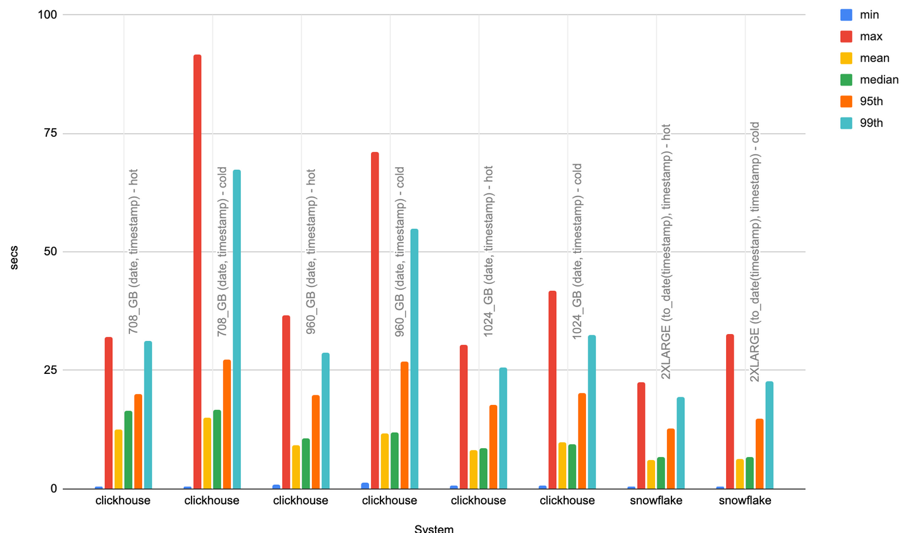

# Top projects by distro

- Aims to test building a pie chart where filtering is performed a non-primary key (`distro.name`).
- Aggregates on project, counting number of downloads, where a filter is applied of `distro.name`. Performs count over last 90 days.
- Uses the top 25 distros.
- Issues a subsequent query filtering by a random timeframe (same for each).

The focus here is performance when filtering by a non-clustered or ordered column. This is not a complete linear scan, as we are still filtering by date/timestamp, but expected performance to be much slower. 

These queries will therefore benefit from distributing computation across all nodes in the cluster (by default ClickHouse uses the receiving node only). 

In Snowflake, this is performed by default. 

In ClickHouse Cloud this requires us to use parallel replicas. This feature allows the work for an aggregation query to be spread across all nodes in the cluster, reading from the same shard. 

## Queries 

## ClickHouse

```sql
-- aggregate on project when filtering on distro.name
SELECT
    project,
    count() AS c
FROM pypi
WHERE (distro.name = 'Ubuntu') AND (date >= (CAST('2023-06-23', 'Date') - toIntervalDay(90)))
GROUP BY project
ORDER BY c DESC
LIMIT 10

-- apply random filtering
SELECT
    project,
    count() AS c
FROM pypi
WHERE (distro.name = 'Ubuntu') AND (date >= (CAST('2023-06-23', 'Date') - toIntervalDay(67))) AND 
      (date <= (CAST('2023-06-23', 'Date') - toIntervalDay(62))) AND 
      (timestamp >= (CAST('2023-06-23 08:33:59', 'DateTime') - toIntervalDay(67))) AND 
      (timestamp <= (CAST('2023-06-23 08:33:59', 'DateTime') - toIntervalDay(62)))
GROUP BY project
ORDER BY c DESC
LIMIT 10
```


## Snowflake

```sql
-- aggregate on project when filtering on distro.name
SELECT project,
       count(*) AS c
FROM pypi
WHERE distro['name'] = 'Ubuntu'
  AND (timestamp >= DATEADD(days, -90, '2023-06-23'::Date))
GROUP BY project
ORDER BY c DESC
LIMIT 10;

-- apply random filtering
SELECT project,
       count(*) AS c
FROM pypi
WHERE distro['name'] = 'Ubuntu'
  AND (timestamp >= DATEADD(days, -67, '2023-06-23 08:33:59'::DateTime))
  AND timestamp <= DATEADD(days, -62, '2023-06-23 08:33:59'::DateTime)
GROUP BY project
ORDER BY c DESC
LIMIT 10;
```

## Test configurations

All tests disable the query cache with `ALTER USER <user> SET USE_CACHED_RESULT = false;` unless stated. ClickHouse query cache is also disabled and file system cache dropped first.

|           Test Config            |                                                                        ClickHouse                                                                         |                                        Snowflake                                        |
|:--------------------------------:|:---------------------------------------------------------------------------------------------------------------------------------------------------------:|:---------------------------------------------------------------------------------------:|
|             default              | Default table configuration and schema for ClickHouse with  `ORDER BY (project, date, timestamp)`. No secondary index, materialized views or projections. |          Default table config and schema. No clustering or materialized views.          |
|       date_project_cluster       |                                                                            NA                                                                             |  CLUSTER ON (to_date(timestamp), project). Automatic clustering allowed to take effect  |
|        parallel_replicas         |                                                        Parallel replicas enabled to use all nodes.                                                        |                                  NA (same as default)                                   |
| parallel_replicas_date_timestamp |                                  Parallel replicas enabled to use all nodes with  `ORDER BY (project, date, timestamp)`.                                  |                                  NA (same as default)                                   |
|      date_timestamp_cluster      |                                                                            NA                                                                             | CLUSTER ON (to_date(timestamp), timestamp). Automatic clustering allowed to take effect |

## Optimizations

### ClickHouse

#### Parallel Replicas

Allows all cluster compute to be used for a query i.e. all nodes used vs a single node.

```sql
use_hedged_requests = 0, allow_experimental_parallel_reading_from_replicas = 1, max_parallel_replicas = 100, parallel_replicas_single_task_marks_count_multiplier = 5;
```

This requires the test to be run with:

```bash
export CLICKHOUSE_SETTINGS="use_hedged_requests = 0, allow_experimental_parallel_reading_from_replicas = 1, max_parallel_replicas = 100, parallel_replicas_single_task_marks_count_multiplier = 5;"
```

## Results

Full results [here](./index.html).

### Enabling Parallel Replicas for ClickHouse
Below we show the performance benefit of enabling parallel replicas for ClickHouse using the original 708 GB service and ordering key of `project, date, timestamp`. This service contains a total of 177 vCPUs spread over 3 nodes.


Observations:

- In both the hot and cold case, our queries times are around 3x faster. This is expected, since all 3 nodes are used for the aggregation and shows the power of parallel replicas for queries where more data needs to be scanned.

### ClickHouse vs Snowflake

In our previous queries, the date and timestamp columns were the 2nd and 3rd entries in our ClickHouse ordering key respectively (with project 1st) - unlike Snowflake where it was beneficial to have the date first. In this workload we have no project filter. We thus optimize this workload using a `date,timestamp` ordering key in ClickHouse to align with Snowflake. 

Parallel replicas are enabled for all results.




Observations:

- For ClickHouse, the best performance is achieved using the largest 1024GB service with 256 vCPUs (the same as Snowflake). 
- For these queries Snowflake is faster by around 30%. This can be attributed to the experimental nature of the parallel replicas feature, with it undergoing active development to improve performance. 
- Snowflake performs well on queries which can be distributed to many nodes and are required to scan significant volumes of data.
