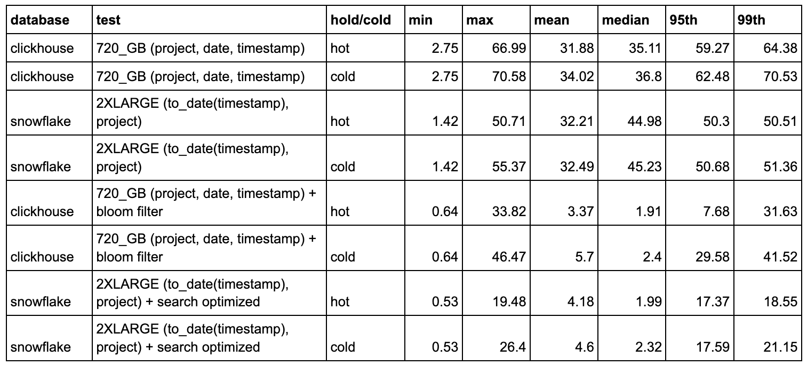
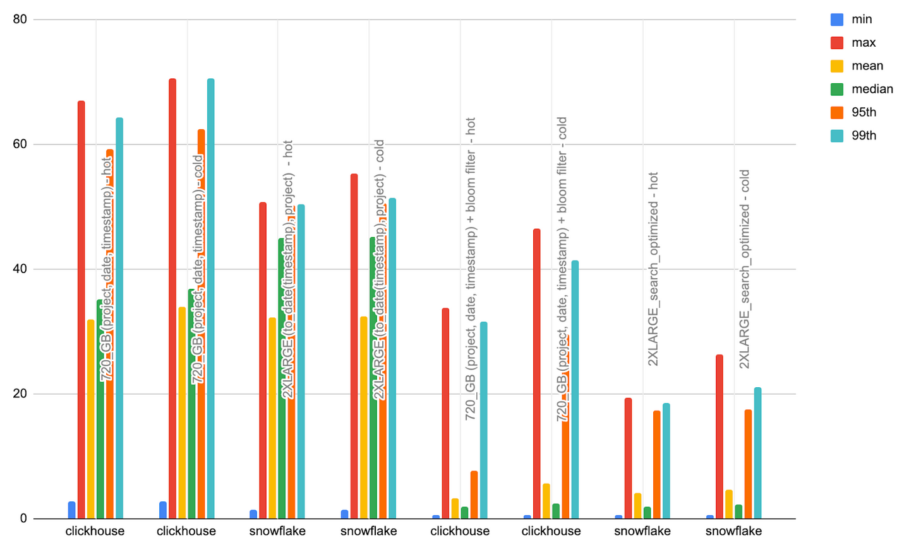

# Top Sub Projects

- Aims to test rendering and filtering of a pie chart showing sub-projects over time. 
- Sub-projects are those that are related to a core technology e.g. `mysql`. These are identified by using `project ILIKE %<term>%`, where `<term`> is selected from a list. This list is identified by taking the top 20 prefixes of names with `-` in their name i.e.

```sql
SELECT splitByChar('-', project)[1] as base from pypi GROUP BY base ORDER BY count() DESC LIMIT 20
```

We have extended this list of 20 with `mysql`, `postgres`, `snowflake`, `elasticsearch` and `clickhouse`  for fun.

- This test aggregates sub-projects for the last 90 days, sorting by number of downloads and filtering to a project term. 
- A narrower time filter is then applied to a random time frame (same random values for both databases). 
- This simulates a user viewing top sub-projects for a term over a time period, and then drilling down to a specific set of days.

This test, while filtering on the project column, is unable to exploit the primary key fully due to the use of the LIKE operator e.g. `project LIKE '%clickhouse%'`. 

This provides an opportunity to utilize ClickHouse secondary indices to accelerate queries. More specifically, we use the bloom filter index to the project column. This indexes n-grams for the strings to accelerate LIKE comparisons. 

We contrast this with ClickHouse’s [search optimization service](https://docs.snowflake.com/en/user-guide/search-optimization-service#substrings-and-regular-expressions) which can also be used to improve LIKE queries.

## Queries 

## ClickHouse

```sql
-- find downloads for projects like `google` in last 90 days
SELECT
    project,
    count() AS c
FROM pypi
WHERE (project LIKE '%google%') AND (date >= (CAST('2023-06-23', 'Date') - toIntervalDay(90)))
GROUP BY project
ORDER BY c DESC
LIMIT 10

-- filter to random time range
SELECT
    project,
    count() AS c
FROM pypi
WHERE (project LIKE '%google%') AND (date >= (CAST('2023-06-23', 'Date') - toIntervalDay(35))) AND 
      (date <= (CAST('2023-06-23', 'Date') - toIntervalDay(15))) AND 
      (timestamp >= (CAST('2023-06-23 08:33:59', 'DateTime') - toIntervalDay(35))) AND 
      (timestamp <= (CAST('2023-06-23 08:33:59', 'DateTime') - toIntervalDay(15)))
GROUP BY project
ORDER BY c DESC
LIMIT 10
```

## Snowflake

```sql
-- find downloads for projects like `google` in last 90 days
SELECT project,
       count(*) c
FROM pypi
WHERE project LIKE '%google%'
  AND (timestamp >= DATEADD(days, -90, '2023-06-23'::Date))
GROUP BY project
ORDER BY c DESC
LIMIT 10;

-- filter to random time range
SELECT project,
       count(*) c
FROM pypi
WHERE project LIKE '%google%'
  AND (timestamp >= DATEADD(days, -35, '2023-06-23 08:33:59'::DateTime))
  AND timestamp <= DATEADD(days, -15, '2023-06-23 08:33:59'::DateTime)
GROUP BY project
ORDER BY c DESC
LIMIT 10;
```

## Test configurations

All tests disable the query cache with `ALTER USER <user> SET USE_CACHED_RESULT = false;` unless stated. ClickHouse query cache is also disabled and file system cache dropped first.

|     Test Config      |                                                                        ClickHouse                                                                         |                                       Snowflake                                       |
|:--------------------:|:---------------------------------------------------------------------------------------------------------------------------------------------------------:|:-------------------------------------------------------------------------------------:|
|       default        | Default table configuration and schema for ClickHouse with  `ORDER BY (project, date, timestamp)`. No secondary index, materialized views or projections. |         Default table config and schema. No clustering or materialized views.         |
| date_project_cluster |                                                                            NA                                                                             | CLUSTER ON (to_date(timestamp), project). Automatic clustering allowed to take effect |
|     bloom_filter     |                           Bloom filter on project column to speed up LIKE. See optimizations below. See [below](#bloom-filter)                            |                                          NA                                           |
|   search_optimized   |                                                                            NA                                                                             |                          Search optimization service enabled                          |

## Optimizations

### ClickHouse

#### Bloom filter

Bloom filter on project column to speed up LIKE.

Our tests indicate this adds around 81.75MiB to our total storage size (compressed). Even uncompressed the overhead is minimal at 7.61GiB.

```sql
ALTER TABLE pypi_bloom
ADD INDEX fts_skip_index project TYPE ngrambf_v1(4, 1024, 1, 0) GRANULARITY 1;

ALTER TABLE pypi_bloom
MATERIALIZE INDEX fts_skip_index;

------------------------------------------------------------
-- without skipping index
------------------------------------------------------------
EXPLAIN indexes = 1
SELECT
    project,
    count() AS c
FROM pypi
WHERE (project LIKE '%google%') AND (date >= (CAST('2023-06-23', 'Date') - toIntervalDay(90)))
GROUP BY project
ORDER BY c DESC
LIMIT 10

┌─explain──────────────────────────────────────────────┐
│ Expression (Projection)                              │
│   Limit (preliminary LIMIT (without OFFSET))         │
│     Sorting (Sorting for ORDER BY)                   │
│       Expression (Before ORDER BY)                   │
│         Aggregating                                  │
│           Expression (Before GROUP BY)               │
│             Filter (WHERE)                           │
│               ReadFromMergeTree (default.pypi)       │
│               Indexes:                               │
│                 PrimaryKey                           │
│                   Keys:                              │
│                     date                             │
│                   Condition: (date in [19441, +Inf)) │
│                   Parts: 28/28                       │
│                   Granules: 7725633/7975227          │
└──────────────────────────────────────────────────────┘

------------------------------------------------------------
-- with skipping index
------------------------------------------------------------
EXPLAIN indexes = 1
SELECT
    project,
    count() AS c
FROM pypi_bloom
WHERE (project LIKE '%google%') AND (date >= (CAST('2023-06-23', 'Date') - toIntervalDay(90)))
GROUP BY project
ORDER BY c DESC
LIMIT 10

┌─explain─────────────────────────────────────────────────┐
│ Expression (Projection)                                 │
│   Limit (preliminary LIMIT (without OFFSET))            │
│     Sorting (Sorting for ORDER BY)                      │
│       Expression (Before ORDER BY)                      │
│         Aggregating                                     │
│           Expression (Before GROUP BY)                  │
│             Filter (WHERE)                              │
│               ReadFromMergeTree (default.pypi_bloom)    │
│               Indexes:                                  │
│                 PrimaryKey                              │
│                   Keys:                                 │
│                     date                                │
│                   Condition: (date in [19441, +Inf))    │
│                   Parts: 31/31                          │
│                   Granules: 7717977/7975221             │
│                 Skip                                    │
│                   Name: fts_skip_index                  │
│                   Description: ngrambf_v1 GRANULARITY 1 │
│                   Parts: 29/31                          │
│                   Granules: 302217/7717977              │
└─────────────────────────────────────────────────────────┘
-- 25 times less granules
```

### Snowflake

#### Search optimization service

This can be enabled on the project column e.g.

```sql
ALTER TABLE PYPI ADD SEARCH OPTIMIZATION ON SUBSTRING(project);
```

Note this will incur additional charges which can be estimated via the [SYSTEM$ESTIMATE_SEARCH_OPTIMIZATION_COSTS](https://docs.snowflake.com/en/sql-reference/functions/system_estimate_search_optimization_costs) table.

## Results

Full results [here](./index.html).





Observations:

- Without the bloom filter, Snowflake and ClickHouse perform similarly for the LIKE queries - with Snowflake even outperforming ClickHouse on the 95th and 99th percentile by up to 30%.
- ClickHouse Bloom filters improve performance for the mean by almost 10x and higher percentiles by at least 2x for both hot and cold queries.
- This ensures ClickHouse comfortably outperforms Snowflake across all metrics with at minimum 1.5x the performance and 9x for the average case. The bloom filter also incurs no additional charges beyond a very small increase in storage.
- The search optimization service significantly improves Snowflake’s performance. While still slower on average than ClickHouse for hot queries, when using the bloom filter, it is faster for cold queries and 99th percentiles. As noted in our cost analysis, however, this comes at a significant cost that makes it almost not viable to use.
